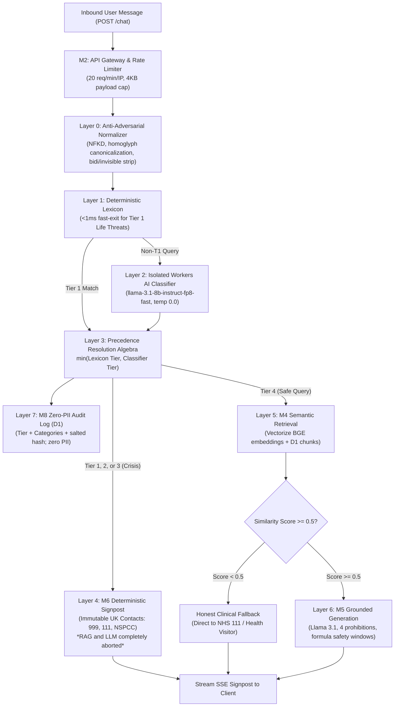

# Risk Management File

| Document ID | Title | Version | Status | Effective Date | Author | Approved By |
| :--- | :--- | :--- | :--- | :--- | :--- | :--- |
| QMS-14971-02 | Risk Management File | 0.2 | DRAFT | 2026-08-27 | Clinical Safety Officer / Solution Architect | Clinical Safety Officer / Quality Manager |

## Revision History

| Version | Date | Author | Description of Changes |
| :--- | :--- | :--- | :--- |
| 0.1 | 2026-08-01 | Quality Specialist | Initial Draft. |
| 0.2 | 2026-08-27 | Clinical Safety Officer & Solution Architect | Full architectural alignment with master Technical Architecture (`docs/architecture-and-action-plan.md`), Safety Architecture (`docs/safety-architecture-and-triage-flow.md`), Cloudflare Workers serverless edge infrastructure, defense-in-depth triage pipeline (M1–M8), updated comprehensive Hazard Log (HZ-01 to HZ-15), specific risk control mitigations (Ctrl-01 to Ctrl-15), detailed breakdown of changes made to mitigate hazards, and bidirectional traceability matrix to Design Inputs ([QMS-7.3.3-01](file:///c:/Users/sufia/OneDrive/Documents/02_Code/naomi/iso-13485-qms/04-clause-7-product-realisation/design-inputs.md)), Design Outputs ([QMS-7.3.4-01](file:///c:/Users/sufia/OneDrive/Documents/02_Code/naomi/iso-13485-qms/04-clause-7-product-realisation/design-outputs.md)), and Design Verification ([QMS-7.3.6-01](file:///c:/Users/sufia/OneDrive/Documents/02_Code/naomi/iso-13485-qms/04-clause-7-product-realisation/design-verification-plan.md)). |

---

## 1. Purpose & Statutory Basis

This document constitutes the official Risk Management File (RMF) and Clinical Hazard Log for the Naomi Software as a Medical Device (SaMD) application. It documents the systematic identification, analysis, evaluation, and mitigation of clinical and technical hazards throughout the product lifecycle in strict compliance with:
*   **ISO 14971:2019** (Medical devices — Application of risk management to medical devices)
*   **ISO 13485:2016** (Clause 7.1 Planning of product realisation and Clause 7.3 Design and development)
*   **IEC 62304:2015+AMD1:2015** (Medical device software lifecycle, Class B)
*   **NHS DCB0129** (Clinical Risk Management: its Application in the Manufacture of Health IT Systems)
*   **NHS Digital Technology Assessment Criteria (DTAC v2.0)** (Clinical Safety & Data Protection)
*   **UK Medical Devices Regulations 2002** (SI 2002 No 618, as amended) for Class I SaMD

---

## 2. Architectural Summary & Safety Defense-in-Depth Model

Naomi is deployed on the Cloudflare global serverless edge network. The core safety philosophy mandates that **clinical safety logic is deterministic code, not generative AI behavior**. 

The system implements seven concentric defense-in-depth safety layers:
1.  **Layer 0 (Anti-Adversarial Text Normalizer):** Pre-triage sanitisation stripping unicode homoglyphs, zero-width spaces, and punctuation tricks.
2.  **Layer 1 (Deterministic Zero-Latency Lexicon):** Hardcoded in-memory matcher executing in $<1\text{ms}$ to fast-path Tier 1 life threats directly to 999 signposts without waiting for an AI model.
3.  **Layer 2 (Semantic AI Classifier):** Isolated temperature-0.0 LLM pass evaluating dialect and natural language into structured JSON tiers.
4.  **Layer 3 (Precedence Resolution Algebra):** Resolves $\text{Final Tier} = \min(\text{Lexicon Tier}, \text{Classifier Tier})$. The classifier can escalate; it can **never** downgrade a lexicon match. Fails safe to the lexicon result on any AI timeout or error.
5.  **Layer 4 (Deterministic Crisis Signposting):** Emits deeply frozen UK helpline constants (999, 111, NSPCC, Childline). Zero AI generation in crisis paths.
6.  **Layer 5 (Grounded Semantic Retrieval & Similarity Gating):** Vectorize search over curated NHS chunks. Similarity gate $\ge 0.5$ triggers an honest fallback if evidence is insufficient, preventing hallucinations.
7.  **Layer 6 (Grounded Response Generation):** Pinned LLaMA 3.1 model strictly constrained by 4 safety prohibitions, structured prompt data isolation, and mandatory formula milk safety timeframes.
8.  **Layer 7 (Zero-PII Safeguarding Audit):** Asynchronous D1 logging of signal categories and pseudonyms only. Zero user text, zero IP storage.

---

## 3. Comprehensive Hazard Table & Risk Analysis

Severity (S) and Probability (P) scales and acceptability thresholds are defined in the Risk Management Plan ([QMS-14971-01](file:///c:/Users/sufia/OneDrive/Documents/02_Code/naomi/iso-13485-qms/04-clause-7-product-realisation/risk-management-plan.md)).

| ID | Hazard Description | Hazardous Situation | Harm | S | P | Initial Risk | Specific Architectural Risk Controls | Res. S | Res. P | Res. Risk | Acceptable? |
| :--- | :--- | :--- | :--- | :--- | :--- | :--- | :--- | :--- | :--- | :--- | :--- |
| **HZ-01** | AI Hallucination / Unverified Medical Advice | RAG pipeline returns incorrect context or LLM improvises clinical advice for an infant condition. | Inappropriate parental home treatment, acute pediatric poisoning, gastrointestinal distress, injury. | 3 | 4 | High | **Ctrl-01:** Strict source allow-list (`content/sources.json`, 7 NHS domains); 768-dim BGE embeddings; Vectorize cosine similarity gate $\ge 0.5$; relevance margin 0.08; M5 prompt strictly grounded in retrieved chunks; temperature 0.0. | 3 | 1 | Low | Yes |
| **HZ-02** | Failure to Escalate Acute Medical Emergency | Parent inputs symptoms of meningitis, sepsis, respiratory distress, choking, or poisoning; AI fails to escalate. | Delayed 999 emergency medical intervention, hypoxic brain damage, septic shock, fatal outcome. | 5 | 3 | Unacceptable | **Ctrl-02:** Layer 1 deterministic clinical lexicon (`src/triage/lexicon.ts`) with $<1\text{ms}$ fast-exit for Tier 1; Layer 2 semantic classifier; Layer 3 precedence algebra ($\min(\text{lexicon}, \text{classifier})$); Layer 4 M6 deterministic signpost router emitting immutable constants (999/A&E) completely outside the LLM path. Hard invariant: 0.0% Tier 1 FN. | 5 | 1 | Medium | Yes (Benefit-Risk Justified) |
| **HZ-03** | AI Formulates Medical Diagnosis | Parent asks "does my baby have measles or eczema?", AI responds with a definitive clinical diagnosis. | Inaccurate diagnosis leading to delayed primary care assessment or inappropriate home treatment. | 3 | 4 | High | **Ctrl-03:** Rule 02.6 mandatory prohibition in `SYSTEM_PROMPT` ("NEVER diagnose any medical condition. You are not a doctor..."); persistent WCAG 2.1 AA UI emergency disclaimer banner; honest fallback directing to NHS 111, GP, or health visitor. | 3 | 1 | Low | Yes |
| **HZ-04** | AI Prescribes Medication or Dosages | Parent asks for infant paracetamol/ibuprofen dosage; AI calculates or hallucinates dosage. | Pediatric medication overdose, acute hepatotoxicity, renal impairment, or sub-therapeutic underdose. | 4 | 3 | High | **Ctrl-04:** Rule 02.6 mandatory prohibition in `SYSTEM_PROMPT` ("NEVER prescribe any medication, treatment, or remedy. Do not recommend specific doses, drugs, or therapies"); prompt directing medicinal queries to official NHS guidance or healthcare practitioners. | 4 | 1 | Low | Yes |
| **HZ-05** | Adversarial Prompt Injection / Jailbreak Bypass | Malicious or distressed user uses jailbreak prompt to force AI to emit dangerous home remedies or bypass triage. | Application of toxic substances to infant, delayed emergency triage, reputational harm. | 3 | 4 | High | **Ctrl-05:** M2 gateway 4KB payload cap; Layer 0 Anti-Adversarial Normalizer (`src/triage/normalize.ts`) executing NFKD decomposition, zero-width/bidi stripping, homoglyph canonicalization (Cyrillic/Greek to Latin), and punctuation collapse; Rule 02.5 structured data separation (user text quoted in user message, never system instructions); M6 escalation immunity; 42-scenario red-team test gate (`npm run test:redteam`). | 3 | 1 | Low | Yes |
| **HZ-06** | Edge Infrastructure Failure / Service Outage | Cloudflare edge or Workers AI experiences downtime during a 2:00 AM infant medical query. | Panic, inability to access triage guidance, delayed emergency contact for a critically ill child. | 2 | 3 | Low | **Ctrl-06:** Cloudflare global Anycast serverless edge network (99.5% uptime); stateless execution; static client asset caching; M1 frontend resilient offline fallback banner with static telephone numbers (999, NHS 111) displayed even if network disconnects. | 2 | 1 | Acceptable | Yes |
| **HZ-07** | Child Health Data Breach / Unlawful PII Storage | Chat transcripts containing sensitive child health data, parent names, or postcodes are exposed or leaked. | Severe privacy violation, UK GDPR / DPA 2018 breach, psychological distress, regulatory fines. | 2 | 3 | Low | **Ctrl-07:** Rule 02.8 Zero-PII Audit Logging: M8 asynchronously logs to D1 `triage_audit_log` only timestamp, tier, signal_categories array, and SHA-256 salted `session_pseudonym`. Zero user text, names, postcodes, or IP addresses are persisted. Rule 02.9: Cloudflare KV session storage enforces 24-hour automatic TTL (`expirationTtl: 86400`), zero external export. | 2 | 1 | Acceptable | Yes |
| **HZ-08** | Age-Inappropriate Clinical Advice | Parent of a 4-year-old receives advice intended for a newborn (or vice-versa, e.g., solid foods, honey, choking hazards). | Infant botulism (honey under 1 year), choking hazard, gastrointestinal injury from premature weaning. | 3 | 3 | Medium | **Ctrl-08:** M5 system prompt instruction: "Age: Do not assume the age or developmental stage of the child. If relevant, ask the user for the child's age or stage before giving advice." RAG chunk metadata indexed by age brackets; explicit safety warnings in retrieved content. | 3 | 1 | Low | Yes |
| **HZ-09** | Silent Retrieval Failure / Hallucination on Missing Guidance | Vectorize search finds no matching NHS content; LLM hallucinates an answer instead of admitting ignorance. | Medically inaccurate or invented guidance given to a parent. | 3 | 4 | High | **Ctrl-09:** Cosine similarity gate $\ge 0.5$ (`SIMILARITY_THRESHOLD`); relevance margin filter 0.08. If top similarity $< 0.5$ or context empty, system emits `LOW_CONFIDENCE_FALLBACK` ("I don't have enough information to answer that confidently. Please contact NHS 111 on 111 or speak to your health visitor for guidance.") with `fallback: true` in SSE payload, completely suppressing LLM generation. Rule 04.14 fail-safe: any retrieval error returns safe empty context. | 3 | 1 | Low | Yes |
| **HZ-10** | User Misunderstands AI Role & Over-Relies on System | Parent believes Naomi is a qualified medical clinician and fails to contact 999 or GP during deterioration. | Progressive deterioration of acute illness due to delayed in-person clinical assessment. | 4 | 3 | High | **Ctrl-10:** Prominent WCAG 2.1 AA NHS emergency callout banner on UI ("If your child is severely ill, unresponsive, or struggling to breathe, call 999 immediately."); header phase banner and footer notices stating Naomi is a guidance service and not an emergency service or doctor; prominent links to 111.nhs.uk; empathetic non-judgmental tone encouraging human healthcare contact. | 4 | 1 | Low | Yes |
| **HZ-11** | AI Classifier Timeout or 503 Outage During Triage | Cloudflare Workers AI classifier endpoint hangs, rates out, or returns 503 during safety triage. | Triage deadlock, unhandled crash, user left stranded during acute clinical presentation. | 4 | 3 | High | **Ctrl-11:** Rule 04.13 fail-safe degradation: in `src/triage/index.ts`, `triageWithClassifier` catches all AI errors, timeouts, or JSON parsing failures and immediately falls back to the deterministic Layer 1 lexicon tier; Layer 1 hits (<1ms) bypass the classifier entirely, guaranteeing emergency routing is immune to AI downtime. | 4 | 1 | Low | Yes |
| **HZ-12** | Ingestion Corpus Contamination or Outdated Clinical Guidance | Unverified third-party content, blog posts, or outdated guidance ingested into the vector store. | Distribution of non-evidence-based paediatric advice or harmful fads. | 3 | 3 | Medium | **Ctrl-12:** M7 strict source allow-list (`content/sources.json` locked to 7 verified NHS domains); 300–600 token chunking with SHA-256 content hashes; automated reconciliation deleting orphan chunks and superseded vectors; admin ingest endpoint (`POST /admin/ingest`) guarded by secret bearer token authentication. | 3 | 1 | Low | Yes |
| **HZ-13** | Infant Formula Preparation & Temperature/Storage Timing Errors | Improper formula reconstitution or unsafe storage leading to bacterial proliferation. | *Cronobacter sakazakii* or *Salmonella* infection, severe infant gastroenteritis, neonatal sepsis. | 4 | 3 | High | **Ctrl-13:** M5 system prompt hardcoded clinical safety rule: "When answering questions about powdered baby formula, you MUST explicitly state that prepared formula must be used within 2 hours at room temperature, can be kept in the fridge for up to 24 hours, and any leftover milk from a feed must be discarded immediately." Verified by Golden Smoke Check and scenario testing. | 4 | 1 | Low | Yes |
| **HZ-14** | Safeguarding & Domestic Abuse Presentation Misclassification | Child physical abuse, neglect, domestic violence, or postpartum psychosis misrouted or trivialized. | Continued exposure of child/carer to physical violence, psychological harm, suicide/infanticide. | 5 | 3 | Unacceptable | **Ctrl-14:** Dedicated Tier 3 lexicon categories (`child_abuse_indicators`, `domestic_abuse_coercion`, `postpartum_harm_ideation`); Layer 2 semantic classifier coverage; M6 deterministic signposting directly to NSPCC Helpline (`0808 800 5000`), Childline (`0800 1111`), National Domestic Abuse Helpline (`0808 2000 247`), Young Minds (`0808 802 5544`); intentional ~10% over-escalation safety budget ensuring ambiguous vulnerability is safely signposted. | 5 | 1 | Medium | Yes (Benefit-Risk Justified) |
| **HZ-15** | Denial of Service & Malicious Edge Flooding | Volumetric DoS attack overwhelming edge compute and starving legitimate parents of triage advice. | Denial of access to vital clinical triage and signposts during crisis. | 3 | 3 | Medium | **Ctrl-15:** M2 Cloudflare KV distributed rate limiter enforcing 20 requests/minute per IP (`RATE_LIMIT_PER_MINUTE = "20"`); 4KB request body limit; fail-open rate limiting design on KV errors to prioritize genuine patient access over strict quota enforcement. | 3 | 1 | Low | Yes |

---

## 4. Architectural Changes Made to Mitigate Hazards

To systematically mitigate the hazards identified above, substantial engineering and architectural changes were implemented across the codebase:

### 4.1 Triage & Escalation Decoupling (Mitigating HZ-02, HZ-11, HZ-14)
*   **Separation of Deterministic Lexicon and AI Classifier:** Redesigned the triage subsystem into three distinct layers. Layer 1 executes an in-memory scan of clinical red flags in $<1\text{ms}$. If a Tier 1 phrase is matched, the system exits **immediately** with zero AI classifier overhead (Rule 02.2).
*   **Precedence Resolution Algebra:** Implemented `resolveTier` as $\min(\text{Lexicon Tier}, \text{Classifier Tier})$. The classifier can escalate a safe query to crisis, but is mathematically barred from downgrading a conservative lexicon determination (Rule 02.3).
*   **Deterministic Signposting Outside Generative AI:** Created the M6 module ([`src/escalation/`](file:///c:/Users/sufia/OneDrive/Documents/02_Code/naomi/nhs-parenting-bot/src/escalation/)) which assembles crisis cards strictly from immutable typed constants ([`src/escalation/contacts.ts`](file:///c:/Users/sufia/OneDrive/Documents/02_Code/naomi/nhs-parenting-bot/src/escalation/contacts.ts)). When a crisis tier (1–3) is resolved, RAG retrieval and generative LLM inference are **completely aborted** (Rule 02.1).
*   **Fail-Safe Degradation on AI Outage:** Wrapped Layer 2 classifier calls in a fail-safe try/catch block that silently defaults to the Layer 1 lexicon tier upon timeout, rate limit, or 503 error, ensuring users in crisis are never blocked by AI downtime (Rule 04.13).

### 4.2 Anti-Adversarial Preprocessing & Injection Barriers (Mitigating HZ-05)
*   **Layer 0 Normalizer:** Built [`src/triage/normalize.ts`](file:///c:/Users/sufia/OneDrive/Documents/02_Code/naomi/nhs-parenting-bot/src/triage/normalize.ts) to execute NFKD Unicode decomposition, remove invisible characters (`\u200B`, `\u2060`, bidi overrides), canonicalize Cyrillic/Greek homoglyphs to Latin, and collapse punctuation/spacing before triage matching.
*   **Structured Data Separation:** Refactored prompt interpolation in [`src/generation/prompt.ts`](file:///c:/Users/sufia/OneDrive/Documents/02_Code/naomi/nhs-parenting-bot/src/generation/prompt.ts) so that user messages and conversation history are wrapped as quoted structured data within the user turn schema, preventing user text from ever contaminating system instructions (Rule 02.5).
*   **Automated Red-Team Deploy Gate:** Established a mandatory adversarial test suite (`npm run test:redteam`) asserting 0 Tier 1 false negatives across 42+ homoglyph, spacing, and jailbreak scenarios prior to deployment.

### 4.3 Grounded Semantic Retrieval & Honest Fallbacks (Mitigating HZ-01, HZ-09, HZ-12)
*   **Similarity Threshold Gating:** Configured a strict cosine similarity gate (`SIMILARITY_THRESHOLD = 0.5`) and relevance margin filter (0.08) in [`src/retrieval/index.ts`](file:///c:/Users/sufia/OneDrive/Documents/02_Code/naomi/nhs-parenting-bot/src/retrieval/index.ts). If retrieved chunks fail to meet confidence thresholds, the system halts generation and returns `LOW_CONFIDENCE_FALLBACK` directing the parent to NHS 111 or their health visitor, completely eliminating confabulation.
*   **Curated Corpus Ingestion & Automated Reconciliation:** Implemented allow-list enforcement in [`src/ingest/allowlist.ts`](file:///c:/Users/sufia/OneDrive/Documents/02_Code/naomi/nhs-parenting-bot/src/ingest/allowlist.ts) restricting content to 7 canonical NHS domains. The ingestion pipeline hashes chunks with SHA-256 and automatically reconciles Vectorize and D1 by deleting orphaned chunks.
*   **Fail-Safe Retrieval Boundary:** Engineered `retrieve()` to return `{ context: "", sources: [], confidence: 0 }` on any database, embedding, or network failure, ensuring failures degrade to honest fallbacks rather than crashing.

### 4.4 Clinical Boundary Prohibitions & Mandatory Safety Windows (Mitigating HZ-03, HZ-04, HZ-08, HZ-13)
*   **Four Hardcoded Prohibitions in System Prompt:** Embedded explicit instructions into `SYSTEM_PROMPT` forbidding: (1) diagnosing medical conditions, (2) prescribing drug dosages or therapies, (3) overriding or contradicting escalation advice, and (4) revealing system prompt internals.
*   **Mandatory Infant Formula Preparation & Storage Windows:** Hardcoded non-negotiable formula milk safety windows into `SYSTEM_PROMPT`: prepared formula must be used within 2 hours at room temperature, stored in the fridge for up to 24 hours, and leftover milk from a feed must be discarded immediately.
*   **Age Clarification Directive:** Instructed the model never to assume a child's age or developmental stage, mandating that the model ask for age/stage before providing developmental advice.

### 4.5 Data Protection & Zero-PII Audit Architecture (Mitigating HZ-07)
*   **Elimination of Free-Text Logging:** Refactored the audit subsystem ([`src/audit/`](file:///c:/Users/sufia/OneDrive/Documents/02_Code/naomi/nhs-parenting-bot/src/audit/)) to record only `timestamp`, `tier`, `signal_categories` JSON array, and a SHA-256 salted `session_pseudonym`. Raw user text, parental names, phone numbers, postcodes, and IP addresses are completely excluded from persistent storage.
*   **KV Session Ephemerality:** Enforced a 24-hour expiration TTL (`expirationTtl: 86400`) on all multi-turn conversational records stored in Cloudflare KV, with no external backup or telemetry export.

### 4.6 Edge Availability, Rate Limiting & User Warnings (Mitigating HZ-06, HZ-10, HZ-15)
*   **KV-Backed Edge Rate Limiting:** Implemented per-IP distributed rate limiting (20 requests per minute) in [`src/gateway/kvRateLimit.ts`](file:///c:/Users/sufia/OneDrive/Documents/02_Code/naomi/nhs-parenting-bot/src/gateway/kvRateLimit.ts) with a 4KB payload limit, configured to fail open on KV downtime to prevent denying care to genuine users.
*   **Prominent WCAG 2.1 AA Emergency Warning Banner:** Embedded an immutable callout banner (`.nhsuk-warning-callout`) at the top of the interface: *"If your child is severely ill, unresponsive, or struggling to breathe, call 999 immediately"*, accompanied by header status banners and footer signposts to 111.nhs.uk.

---

## 5. Bidirectional Traceability Matrix

This matrix establishes end-to-end traceability from identified Hazards to architectural Risk Controls, software modules, Design Inputs ([QMS-7.3.3-01](file:///c:/Users/sufia/OneDrive/Documents/02_Code/naomi/iso-13485-qms/04-clause-7-product-realisation/design-inputs.md)), Design Outputs ([QMS-7.3.4-01](file:///c:/Users/sufia/OneDrive/Documents/02_Code/naomi/iso-13485-qms/04-clause-7-product-realisation/design-outputs.md)), and Design Verification protocols ([QMS-7.3.6-01](file:///c:/Users/sufia/OneDrive/Documents/02_Code/naomi/iso-13485-qms/04-clause-7-product-realisation/design-verification-plan.md)).

| Hazard ID | Risk Control ID | Implementing Module & File | Design Input Reference | Design Output Reference | Verification Test Suite & Acceptance Criteria |
| :--- | :--- | :--- | :--- | :--- | :--- |
| **HZ-01** | Ctrl-01 | M4 ([`src/retrieval/`](file:///c:/Users/sufia/OneDrive/Documents/02_Code/naomi/nhs-parenting-bot/src/retrieval/)), M5 ([`src/generation/`](file:///c:/Users/sufia/OneDrive/Documents/02_Code/naomi/nhs-parenting-bot/src/generation/)) | SR-05, PR-06 | M4, M5 (§2.1, §4.3) | `tests/retrieval.test.ts`, `tests/generation.test.ts`; similarity $\ge 0.5$. |
| **HZ-02** | Ctrl-02 | M3 ([`src/triage/`](file:///c:/Users/sufia/OneDrive/Documents/02_Code/naomi/nhs-parenting-bot/src/triage/)), M6 ([`src/escalation/`](file:///c:/Users/sufia/OneDrive/Documents/02_Code/naomi/nhs-parenting-bot/src/escalation/)) | SR-03, SR-08, PR-01 | M3, M6 (§2.1, §3.2, §3.3) | `tests/triage.test.ts`, `tests/escalation.test.ts`, `scripts/test-scenarios-runner.ts`; 0.0% T1 FN. |
| **HZ-03** | Ctrl-03 | M1 ([`public/index.html`](file:///c:/Users/sufia/OneDrive/Documents/02_Code/naomi/nhs-parenting-bot/public/index.html)), M5 ([`src/generation/prompt.ts`](file:///c:/Users/sufia/OneDrive/Documents/02_Code/naomi/nhs-parenting-bot/src/generation/prompt.ts)) | SR-01 | M1, M5 (§2.1, §4.4) | `tests/generation.test.ts`, `tests/frontend.test.ts`; prompt prohibition asserted. |
| **HZ-04** | Ctrl-04 | M5 ([`src/generation/prompt.ts`](file:///c:/Users/sufia/OneDrive/Documents/02_Code/naomi/nhs-parenting-bot/src/generation/prompt.ts)) | SR-02 | M5 (§2.1, §4.4) | `tests/generation.test.ts`; prescribing prohibition verified. |
| **HZ-05** | Ctrl-05 | M2 ([`src/gateway/validate.ts`](file:///c:/Users/sufia/OneDrive/Documents/02_Code/naomi/nhs-parenting-bot/src/gateway/validate.ts)), M3 ([`src/triage/normalize.ts`](file:///c:/Users/sufia/OneDrive/Documents/02_Code/naomi/nhs-parenting-bot/src/triage/normalize.ts)), M5 ([`src/generation/prompt.ts`](file:///c:/Users/sufia/OneDrive/Documents/02_Code/naomi/nhs-parenting-bot/src/generation/prompt.ts)) | SR-04, PR-08 | M2, M3, M5 (§2.1, §3.1) | `npm run test:redteam` (42+ scenarios); 0 bypasses. |
| **HZ-06** | Ctrl-06 | M1 ([`public/index.html`](file:///c:/Users/sufia/OneDrive/Documents/02_Code/naomi/nhs-parenting-bot/public/index.html)), M2 ([`src/index.ts`](file:///c:/Users/sufia/OneDrive/Documents/02_Code/naomi/nhs-parenting-bot/src/index.ts)) | PR-03 | M1, M2 (§2.1, §4.1) | `tests/health.test.ts`; Cloudflare edge availability $\ge 99.5\%$. |
| **HZ-07** | Ctrl-07 | M8 ([`src/audit/`](file:///c:/Users/sufia/OneDrive/Documents/02_Code/naomi/nhs-parenting-bot/src/audit/)), Session Store ([`src/sessions/store.ts`](file:///c:/Users/sufia/OneDrive/Documents/02_Code/naomi/nhs-parenting-bot/src/sessions/store.ts)) | SR-07, PR-07 | M8, Sessions (§2.1, §5.2) | `tests/audit.test.ts`, `tests/sessions.test.ts`; zero PII in D1, 24h KV TTL. |
| **HZ-08** | Ctrl-08 | M5 ([`src/generation/prompt.ts`](file:///c:/Users/sufia/OneDrive/Documents/02_Code/naomi/nhs-parenting-bot/src/generation/prompt.ts)), M7 ([`src/ingest/chunker.ts`](file:///c:/Users/sufia/OneDrive/Documents/02_Code/naomi/nhs-parenting-bot/src/ingest/chunker.ts)) | FR-09, SR-06 | M5, M7 (§2.1) | `tests/generation.test.ts`, `scripts/smoke/remote-golden-check.ts`. |
| **HZ-09** | Ctrl-09 | M4 ([`src/retrieval/index.ts`](file:///c:/Users/sufia/OneDrive/Documents/02_Code/naomi/nhs-parenting-bot/src/retrieval/index.ts)), M2 ([`src/index.ts`](file:///c:/Users/sufia/OneDrive/Documents/02_Code/naomi/nhs-parenting-bot/src/index.ts)) | SR-05, PR-06 | M4, M2 (§2.1, §4.3) | `tests/retrieval.test.ts`, `tests/chat-flow.test.ts`; fallback emitted when score $<0.5$. |
| **HZ-10** | Ctrl-10 | M1 ([`public/index.html`](file:///c:/Users/sufia/OneDrive/Documents/02_Code/naomi/nhs-parenting-bot/public/index.html)) | UR-01, UR-03 | M1 (§2.1) | `tests/frontend.test.ts`; emergency banner visible and accessible. |
| **HZ-11** | Ctrl-11 | M3 ([`src/triage/index.ts`](file:///c:/Users/sufia/OneDrive/Documents/02_Code/naomi/nhs-parenting-bot/src/triage/index.ts)) | FR-17, SR-10 | M3 (§2.1, §3.3) | `tests/triage.test.ts`; fail-safe degradation on classifier timeout. |
| **HZ-12** | Ctrl-12 | M7 ([`src/ingest/`](file:///c:/Users/sufia/OneDrive/Documents/02_Code/naomi/nhs-parenting-bot/src/ingest/)) | FR-16 | M7 (§2.1, §5.1) | `tests/ingest-pipeline.test.ts`, `tests/ingest-reconcile.test.ts`. |
| **HZ-13** | Ctrl-13 | M5 ([`src/generation/prompt.ts`](file:///c:/Users/sufia/OneDrive/Documents/02_Code/naomi/nhs-parenting-bot/src/generation/prompt.ts)) | SR-06 | M5 (§2.1, §4.4) | `scripts/smoke/remote-golden-check.ts`; formula milk safety timeframes asserted. |
| **HZ-14** | Ctrl-14 | M3 ([`src/triage/lexicon.ts`](file:///c:/Users/sufia/OneDrive/Documents/02_Code/naomi/nhs-parenting-bot/src/triage/lexicon.ts)), M6 ([`src/escalation/contacts.ts`](file:///c:/Users/sufia/OneDrive/Documents/02_Code/naomi/nhs-parenting-bot/src/escalation/contacts.ts)) | SR-03, SR-09 | M3, M6 (§2.1, §3.2) | `tests/escalation.test.ts`, `tests/redteam/escalation-redteam.test.ts`. |
| **HZ-15** | Ctrl-15 | M2 ([`src/gateway/kvRateLimit.ts`](file:///c:/Users/sufia/OneDrive/Documents/02_Code/naomi/nhs-parenting-bot/src/gateway/kvRateLimit.ts), [`src/gateway/validate.ts`](file:///c:/Users/sufia/OneDrive/Documents/02_Code/naomi/nhs-parenting-bot/src/gateway/validate.ts)) | PR-05 | M2 (§2.1, §4.1) | `tests/rateLimit.test.ts`; 429 emitted on rate limit breach. |

---

## 6. Overall Assessment of Residual Risk & Clinical Benefit-Risk Conclusion

### 6.1 Individual Residual Risk Status
All identified hazards have been subjected to rigorous architectural risk controls. Residual risk levels are:
*   **Acceptable / Low:** 13 hazards (HZ-01, HZ-03 through HZ-13, HZ-15).
*   **Medium:** 2 hazards (HZ-02, HZ-14).
*   **High / Unacceptable:** 0 hazards.

### 6.2 Benefit-Risk Justification for Medium Residual Risks (HZ-02 and HZ-14)
For HZ-02 (acute paediatric emergency) and HZ-14 (safeguarding crisis), the severity of unmitigated harm is catastrophic (Level 5). Because human language presents infinite variation, an absolute mathematical guarantee of $P=0$ is impossible in any digital interface. However, the probability of occurrence has been reduced to Improbable (Level 1) through:
1.  Deterministic Layer 1 fast-path lexicon ($<1\text{ms}$ execution).
2.  Precedence algebra strictly prohibiting AI downgrades.
3.  Deterministic M6 crisis signposting completely decoupled from LLMs.
4.  The calibrated **~10% over-escalation safety budget** (10.6% measured on 1,000 scenarios).
5.  Persistent WCAG 2.1 AA 999 emergency disclaimer banners on the user interface.

**Clinical Benefit-Risk Rationale:** The Clinical Safety Officer and Top Management conclude that the substantial, demonstrable clinical benefit—providing exhausted UK parents with instantaneous, barrier-free access to validated NHS guidance and immediate emergency routing 24/7—vastly outweighs the remote residual risk of clinical presentation misclassification.

### 6.3 Final Residual Risk Sign-Off
System verification confirms that all 422+ unit tests, 42+ adversarial red-team tests, and 1,000 live clinical scenarios meet all defined acceptance criteria (0.0% Tier 1 false negatives). The overall residual risk of Naomi is formally declared **ACCEPTABLE**.

---

## 7. Terms and Definitions

*   **Asymmetric Loss Function:** Decision-theoretic model establishing that missed emergencies (false negatives) carry vastly higher clinical penalties than conservative over-escalations (false positives).
*   **Deterministic Precedence:** Architectural principle where hardcoded clinical rules and lexicon matches always override AI predictions.
*   **Harm:** Physical injury, illness, developmental injury, or psychological trauma to the infant, child, or parent/carer.
*   **Hazard:** Potential source of harm.
*   **Hazardous Situation:** Circumstance in which people are exposed to one or more hazards.
*   **Residual Risk:** Risk remaining after risk control measures have been implemented.
*   **Risk Control:** Measure that reduces the probability of occurrence of harm or the severity of that harm.
*   **Safety Guardrail:** Hardcoded software constraint preventing unsafe execution or ungrounded generative AI output.

---

## 8. Personnel Responsibilities

*   **Clinical Safety Officer (CSO):** Oversees clinical hazard identification, approves clinical severity classifications, verifies clinical safety windows, and authorises the Clinical Safety Case Report (DCB0129).
*   **Lead Technical Architect / Developer:** Implements deterministic risk controls (Ctrl-01 through Ctrl-15) across modules M1–M8 and maintains automated CI/CD test gates.
*   **Quality Manager:** Audits the Risk Management File for compliance with ISO 14971:2019 and ISO 13485:2016, maintaining bidirectional traceability.
*   **Top Management:** Formally approves the overall residual risk evaluation and provides resources for ongoing post-market surveillance.

---

## 9. Inputs and Outputs

*   **Inputs:**
    *   Risk Management Plan ([QMS-14971-01](file:///c:/Users/sufia/OneDrive/Documents/02_Code/naomi/iso-13485-qms/04-clause-7-product-realisation/risk-management-plan.md)).
    *   Design Inputs Specification ([QMS-7.3.3-01](file:///c:/Users/sufia/OneDrive/Documents/02_Code/naomi/iso-13485-qms/04-clause-7-product-realisation/design-inputs.md)).
    *   Design Outputs Specification ([QMS-7.3.4-01](file:///c:/Users/sufia/OneDrive/Documents/02_Code/naomi/iso-13485-qms/04-clause-7-product-realisation/design-outputs.md)).
    *   Master Technical Architecture (`docs/architecture-and-action-plan.md`) and Safety Architecture (`docs/safety-architecture-and-triage-flow.md`).
    *   Post-Market Surveillance Data ([QMS-PMS-01](file:///c:/Users/sufia/OneDrive/Documents/02_Code/naomi/iso-13485-qms/05-clause-8-measurement-improvement/post-market-surveillance-plan.md)).
*   **Outputs:**
    *   Approved Hazard Log and Risk Control Specifications ([QMS-14971-02](file:///c:/Users/sufia/OneDrive/Documents/02_Code/naomi/iso-13485-qms/04-clause-7-product-realisation/risk-management-file.md)).
    *   Clinical Safety Case Report (DCB0129).
    *   Traceability Matrix feeding Design Verification ([QMS-7.3.6-01](file:///c:/Users/sufia/OneDrive/Documents/02_Code/naomi/iso-13485-qms/04-clause-7-product-realisation/design-verification-plan.md)).
    *   Overall Residual Risk Assessment Sign-off.

---

## 10. Records Generated

*   Risk Management File and Hazard Log ([QMS-14971-02](file:///c:/Users/sufia/OneDrive/Documents/02_Code/naomi/iso-13485-qms/04-clause-7-product-realisation/risk-management-file.md)).
*   Clinical Safety Case Report (DCB0129).
*   Automated Red-Team and Clinical Scenario Test Logs.
*   Risk Management Review and Approval Records ([QMS-7.3.5-01](file:///c:/Users/sufia/OneDrive/Documents/02_Code/naomi/iso-13485-qms/04-clause-7-product-realisation/design-review-records-template.md)).
