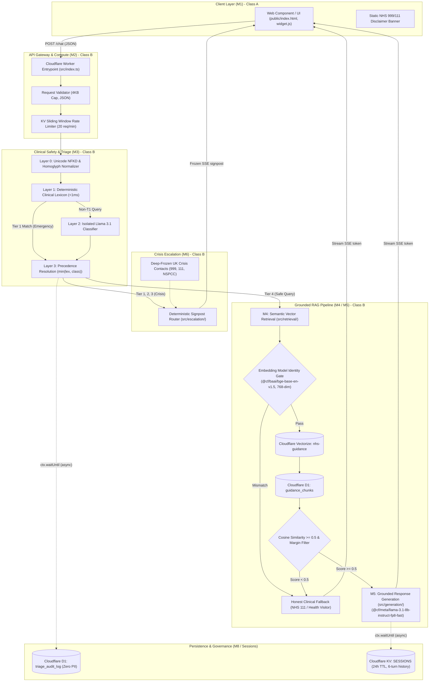

# Software Lifecycle Plan

| Document ID | Title | Version | Status | Effective Date | Author | Approved By |
| :--- | :--- | :--- | :--- | :--- | :--- | :--- |
| QMS-62304-01 | Software Lifecycle Plan | 0.2 | DRAFT | 2026-08-27 | Senior Technical & Solution Architect | Clinical Safety Officer / Quality Manager |

## Revision History

| Version | Date | Author | Description of Changes |
| :--- | :--- | :--- | :--- |
| 0.1 | 2026-08-01 | Quality Specialist | Initial Draft. |
| 0.2 | 2026-08-27 | Solution Architect | Full architectural alignment with master Technical Architecture & Implementation Plan, Safety Architecture, Cloudflare Workers serverless edge runtime (`workerd`), modular decomposition (M1–M8), deterministic multi-layer triage (L0–L3), pinned AI models (`@cf/meta/llama-3.1-8b-instruct-fp8-fast`, `@cf/baai/bge-base-en-v1.5`), fail-closed embedding gates, frozen public SSE contracts, automated verification and adversarial red-team gates (`npm test`, `npm run test:redteam`), comprehensive IEC 62304 Class B lifecycle processes (Clauses 5.1–5.8, 6, 7, 8, 9), and linkage to standalone SOUP Inventory and Evaluation Log ([`QMS-62304-02`](./soup-log.md)). |

---

## 1. Purpose, Scope, and Statutory Basis

### 1.1 Purpose
This document establishes the formal Software Development Lifecycle (SDLC) plan, safety classification, maintenance framework, configuration management protocol, problem resolution process, and SOUP management strategy for **Naomi**, an AI-powered conversational Software as a Medical Device (SaMD) providing NHS-grounded guidance to UK parents and carers of infants and young children aged 0 to 5 years.

This plan guarantees that software development, maintenance, and risk mitigation activities are executed in a disciplined, repeatable, and audit-ready manner throughout the entire product lifecycle.

### 1.2 Statutory and Regulatory Framework
This plan is authored, maintained, and enforced in full conformity with the following statutory and regulatory standards:
*   **IEC 62304:2015+AMD1:2015** (*Medical device software — Software life cycle processes*)
*   **ISO 13485:2016** (*Medical devices — Quality management systems — Requirements for regulatory purposes*), specifically Clause 7.3 (Design and Development) and Clause 7.5 (Production and Service Provision)
*   **ISO 14971:2019** (*Medical devices — Application of risk management to medical devices*)
*   **UK Medical Devices Regulations 2002 (SI 2002 No 618, as amended)** (UK MDR 2002) governing Class I Software as a Medical Device
*   **NHS Digital Technology Assessment Criteria (DTAC v2.0)** (Section C1 Clinical Safety, Section C2 Technical Security, Section D1 Data Protection)
*   **NHS DCB0129** (*Clinical Risk Management: its Application in the Manufacture of Health IT Systems*)
*   **UK GDPR / Data Protection Act 2018** and **NHS Caldicott Principles**

### 1.3 Scope
The scope of this Software Lifecycle Plan encompasses:
1.  All custom software source code, build scripts, deployment scripts, database schemas, and configuration manifests across the eight architectural modules:
    *   **M1:** Frontend Widget & Accessible Client (`public/index.html`, `public/widget.js`)
    *   **M2:** API Gateway, CORS, & KV Rate Limiter (`src/index.ts`, `src/gateway/`)
    *   **M3:** Clinical Safety & Multi-Layer Triage (`src/triage/`)
    *   **M4:** Grounded Semantic Vector Retrieval (`src/retrieval/`)
    *   **M5:** Grounded Response Generation (`src/generation/`)
    *   **M6:** Crisis Escalation & Signposting Router (`src/escalation/`)
    *   **M7:** Knowledge Ingestion & Governance Pipeline (`src/ingest/`, `scripts/ingest/`)
    *   **M8:** Anonymised Safeguarding & Triage Audit Logger (`src/audit/`)
2.  All external Software of Unknown Provenance (SOUP) and cloud infrastructure platforms incorporated into Naomi, including Cloudflare Workers runtime (`workerd`), Cloudflare Vectorize, Cloudflare D1 SQLite, Cloudflare Workers KV, Meta Llama 3.1 inference models, and BAAI BGE vector embedding models.
3.  All verification, adversarial red-teaming, clinical scenario execution, and regression testing suites.
4.  All operational activities from initial requirements analysis through deployment, post-market monitoring, defect resolution, and software decommissioning.

---

## 2. Software Safety Classification & Component Safety Check (IEC 62304 Clause 4.3)

### 2.1 Software System Safety Classification: Class B

In accordance with IEC 62304:2015+AMD1:2015 Clause 4.3(a):
*   **Class A:** No injury or damage to health is possible.
*   **Class B:** Non-serious injury is possible.
*   **Class C:** Death or serious injury is possible.

**Software System Classification Determination: Class B**

#### 2.1.1 Clinical and Technical Justification
Naomi is an AI-powered conversational Software as a Medical Device (SaMD) providing non-judgmental, NHS-grounded guidance to UK parents and carers of infants and young children aged 0 to 5 years. It is designed as an informational health assistant and crisis triage router. It does not control life-sustaining apparatus, deliver therapeutic interventions, or perform formal clinical diagnosis.

However, as evaluated in the [Risk Management File (QMS-14971-02)](file:///c:/Users/sufia/OneDrive/Documents/02_Code/naomi/iso-13485-qms/04-clause-7-product-realisation/risk-management-file.md) and Clinical Hazard Log:
1.  **Potential for Indirect Harm through Delayed Care (Hazards HZ-02, HZ-03, HZ-04):** A silent software failure in clinical triage or generative safety boundaries (e.g. misclassifying neonatal hypothermia, sepsis, anaphylaxis, or acute respiratory distress as benign, or generating reassuring self-care advice during a life-threatening crisis) could lead a parent to delay seeking emergency medical attention (999 or A&E). Such a delay has the credible potential to result in temporary or non-serious physiological deterioration (Class B).
2.  **Mitigation of Class C Harm:** Severe injury or death (Class C) is prevented through deterministic risk controls: the **Layer 1 Deterministic Lexicon (<1ms fast-exit)**, **Layer 3 Precedence Resolution Algebra** (`resolveTier` where Tier 1 emergency hits are immutable), **Fail-Closed Embedding Identity Gates**, and **Deep-Frozen Crisis Signposts (M6)**. Furthermore, real-world parental behavior in acute paediatric distress is multi-channel; physical symptoms (e.g. respiratory arrest, cyanosis) naturally trigger emergency action independent of the software.

Consequently, at the software system level, Naomi is formally categorized as **Software Safety Class B**.

---

### 2.2 Classification Principle: Failure-to-Inoperability vs Undetected Clinical Harm

In accordance with IEC 62304 Clause 4.3(c) and ISO 14971 risk management principles, the assignment of safety classes to individual software items must evaluate the credible failure modes of each component and whether that failure can cause patient harm or merely renders the system inoperable:

*   **Failure Mode 1: Failure to Inoperability (Fail-Safe Outage):**
    When a software component fails (crashes, throws an unhandled exception, times out, or detects a corrupted dependency) and the resultant behavior is that the request is cleanly terminated, returns an HTTP error code (400, 429, 500), or degrades to an explicit honest fallback message ("Please contact NHS 111 or your GP"), the system is rendered **inoperable**.
    Because Naomi is an informational conversational assistant and **not** an active life-support system or continuous vital-sign monitor, **rendering the system inoperable cannot cause physical injury or damage to health**. The parent receives no misleading reassurance, encounters an unavailable or error state, and naturally resorts to standard healthcare pathways (NHS 111 or 999), as reinforced by the static emergency disclaimer banner. Software components whose failure strictly results in system inoperability or safe clinical fallbacks are formally classified as **Software Safety Class A**.
*   **Failure Mode 2: Silent or Misleading Clinical Output (Undetected Harm):**
    A software component whose failure could silently produce an undetected hazard—such as misclassifying an acute paediatric emergency as safe, generating contraindicated medical dosage/feeding advice, or corrupting emergency service telephone numbers—without halting the system, has the potential to contribute to indirect harm. Software items exhibiting this failure profile are classified as **Software Safety Class B**.

---

### 2.3 Architectural Component Safety Class Check (IEC 62304 Clause 4.3(b))

Each architectural module, subcomponent, and persistence layer across the Naomi system has been subjected to a rigorous safety classification check based on its failure modes, potential for harm, and implemented defensive boundaries:

| Component ID | Component Name & Scope | Architectural Function | Evaluated Failure Modes | Failure Effect: Inoperability vs Harm | Implemented Risk Controls & Segregation | Assigned Safety Class | Applicable IEC 62304 Rigor |
| :--- | :--- | :--- | :--- | :--- | :--- | :--- | :--- |
| **M1** | Frontend Widget & Client (`public/widget.js`, `index.html`) | UI rendering, user query input, SSE stream parsing, WCAG 2.1 AA accessible display. | Script syntax error, DOM crash, stream parser exception, WebSocket/SSE disconnect. | **Renders system inoperable.** Chat interface freezes or displays connection error. Parent cannot submit query; no misleading clinical advice is generated. | Static NHS 999/111 emergency banner hardcoded in static HTML; standard browser error isolation. | **Class A** | Clauses 5.1–5.3, 5.5 (Basic unit verification), 5.8 (Release). |
| **M2** | API Gateway & Orchestrator (`src/index.ts`, `src/gateway/*`) | HTTP routing, JSON validation (4KB cap), CORS preflight, KV rate limiting (20 req/min), global error boundary. | Request parsing exception, rate limiter timeout, invalid routing, unhandled error. | **Renders system inoperable.** Returns HTTP 400, 429, or sanitized HTTP 500 via global error boundary (`src/gateway/error.ts`). Zero clinical output or triage bypassed. | Global error handler intercepts all exceptions, preventing unhandled crashes and data leakage (*Rule 04.14*). | **Class A** | Clauses 5.1–5.3, 5.5 (Unit verification), 5.8 (Release). |
| **M3.0** | Triage Layer 0: Normalizer (`src/triage/normalize.ts`) | Unicode NFKD decomposition, de-homoglyphing, zero-width space stripping. | Regex failure, character unmapped, formatting character bypass. | **Potential contributor to harm.** Failure could allow an adversarial homoglyph or zero-width character to bypass Layer 1 lexicon. | Redundant defense: Layer 2 LLM classifier evaluates semantic intent; unit red-team tests (`tests/redteam/`). | **Class B** | Clauses 5.1–5.7 (Detailed design, unit testing, integration, red-team verification). |
| **M3.1** | Triage Layer 1: Deterministic Lexicon (`src/triage/lexicon.ts`) | $<1\text{ms}$ regex keyword scan across 12 Tier 1, 10 Tier 2, and 8 Tier 3 clinical categories. | Omission of critical clinical synonym, regex boundary defect. | **Potential contributor to harm.** False negative on Tier 1 emergency could allow query to proceed to benign generation without emergency escalation. | Layer 2 classifier acts as secondary risk escalation; fail-safe degradation to Tier 2 on exception (*Rule 02.3*); mandatory red-team deploy gate asserting 0 Tier 1 false negatives (*Rule 02.11*). | **Class B (Highest Safety Criticality)** | Clauses 5.1–5.7 (Detailed design, unit verification, mandatory adversarial red-team gate). |
| **M3.2** | Triage Layer 2: LLM Classifier (`src/triage/classifier.ts`) | Isolated `@cf/meta/llama-3.1-8b-instruct-fp8-fast` secondary risk triage. | Model timeout, malformed JSON output, under-classification of subtle emergency. | **Dual mode:** If classifier throws or times out, it **renders classifier inoperable** and safely degrades to lexicon. If classifier under-classifies, Tier 1 is already caught by Layer 1. However, could miss Tier 2/3 subtle urgency. | `resolveTier` algebra: classifier can only escalate, NEVER downgrade (*Rule 02.2*); complete context isolation from generation (*Rule 04.13*). | **Class B** | Clauses 5.1–5.7 (Detailed design, contract testing, unit verification). |
| **M3.3** | Triage Layer 3: Precedence Resolution (`resolveTier`) | Mathematical precedence algebra combining lexicon and classifier tiers ($\min(\text{lex}, \text{class})$). | Logic defect allowing tier downgrade. | **Potential contributor to harm.** If logic inverted, an emergency query could be demoted to safe status. | Pure synchronous function; immutable Tier 1 precedence; 100% unit test coverage in `tests/triage-classifier.test.ts`. | **Class B** | Clauses 5.1–5.7 (Detailed design, unit testing, boundary analysis). |
| **M4.1** | BGE Embedding Generator (`src/retrieval/index.ts`) | Generates 768-dim vector embeddings via `@cf/baai/bge-base-en-v1.5`. | Workers AI embedding API throw, timeout, or malformed array output. | **Renders retrieval inoperable.** Caught by try/catch and returns `SAFE_EMPTY` (`context: ""`). Triggers honest clinical fallback in M5. | Polymorphic `extractEmbedding` parser; try/catch returns `SAFE_EMPTY` (*Rule 04.14*). | **Class A** | Clauses 5.1–5.3, 5.5. |
| **M4.2** | Fail-Closed Embedding Gate (`src/retrieval/index.ts:76–83`) | Verifies model name matches `@cf/baai/bge-base-en-v1.5` and dimensions === 768. | Logic bug allowing dimension mismatch. | **Safety Risk Control.** If gate fails to block mismatched model, vector search could return corrupted or irrelevant chunks. | Fail-closed design: aborts retrieval immediately and returns safe empty context before any AI call. 4 passing unit tests. | **Class B** | Clauses 5.1–5.7 (Detailed design, unit verification). |
| **M4.3–M4.5** | Vectorize Search, D1 Hydration & Similarity Gate | Vector cosine search on `nhs-guidance`, D1 chunk text fetch, similarity $\ge 0.5$ gating. | Vectorize drop, D1 timeout, similarity $<0.5$. | **Renders retrieval inoperable.** Returns `SAFE_EMPTY`. M5 detects empty context and returns honest clinical fallback ("Contact NHS 111 or GP"). No harmful advice generated. | Fail-safe empty return; similarity threshold ($\ge 0.5$) and relevance margin filter (0.08) prevent low-confidence improvisation (*Spec §4 M4*). | **Class A** | Clauses 5.1–5.3, 5.5 (Unit verification). |
| **M5.1–M5.2** | Structured Prompt & Safety Guardrails (`src/generation/prompt.ts`) | Constructs LLM prompt enforcing 4 prohibitions (no diagnosis, no prescription, no escalation override, no prompt reveal) and infant feeding safety windows (2h/24h/discard). | Prompt leakage, injection vulnerability, omission of feeding timeframes. | **Potential contributor to harm.** Failure could allow LLM to hallucinate drug dosages or provide dangerous formula storage guidance (infant botulism / bacterial infection risk). | Hardcoded system prompt safety rules (*Rule 02.6*); structured quoting of user input (*Rule 02.5*); unit tests asserting safety keywords (`tests/generation.test.ts`). | **Class B** | Clauses 5.1–5.7 (Detailed design, unit testing, red-team verification). |
| **M5.3** | LLaMA 3.1 Response Generator (`src/generation/index.ts`) | Streaming response synthesis via `@cf/meta/llama-3.1-8b-instruct-fp8-fast`. | LLM inference throw, network disconnect, token stream break. | **Renders generation inoperable.** Emits `error` event then `done` with fallback `generation_error`. No harmful output emitted. | Handled by generator try/catch; fails safe to honest clinical fallback. | **Class A** (When prompt guardrails M5.2 are verified). | Clauses 5.1–5.3, 5.5. |
| **M6** | Crisis Escalation & Signposting (`src/escalation/*`) | Emits frozen signpost payloads with immutable UK crisis numbers (999, 111, NSPCC, Childline). | Incorrect telephone number, routing failure. | **Potential contributor to harm.** Corrupted emergency contact number could prevent distressed parent from reaching emergency services during life-threatening crisis. | Pure synchronous function; deep-frozen constants (`Object.freeze`) matching `.kilo/rules/01-project-context.md` verbatim; zero LLM text in output; unit red-team tests (`tests/redteam/escalation-redteam.test.ts`). | **Class B** | Clauses 5.1–5.7 (Detailed design, unit testing, red-team verification). |
| **M7** | Knowledge Ingestion Pipeline (`src/ingest/*`, `scripts/ingest/*`) | Offline allowlist validation (7 NHS domains), chunking, SHA-256 hashing, Queues/R2 batching. | Parser crash, queue timeout, chunking defect. | **Renders ingestion inoperable.** Offline batch script fails or dead-letters; production runtime continues serving existing verified corpus. | SHA-256 chunk hash verification (`id === sha256(text)`); allowlist validation; isolated admin authentication. | **Class A** | Clauses 5.1–5.3, 5.5. |
| **M8** | Safeguarding Audit Logger (`src/audit/*`) | Asynchronous non-blocking logging of coarse triage tiers to D1 `triage_audit_log` via `ctx.waitUntil()`. | D1 write error, SQL contention. | **Renders audit inoperable.** Log entry is lost; user chat response and clinical triage proceed unaffected. Zero PII stored. | Wrapped in `try/catch` inside `ctx.waitUntil()`; audit failure never blocks or impacts chat response. | **Class A** | Clauses 5.1–5.3, 5.5. |
| **P1** | Cloudflare Workers KV (`SESSIONS`) | Ephemeral session history (24h TTL, 6 turns) and IP sliding window rate limit store. | KV timeout, read/write error. | **Renders session/rate store inoperable.** Rate limiter fails safe; session history drops to single-turn. Triage evaluates query statelessly. | Stateless triage invariance (M3 does not depend on KV state); 24h TTL auto-expiry. | **Class A** | Clauses 5.1–5.3, 5.5. |
| **P2** | Cloudflare D1 SQLite Database | Relational storage for guidance chunks and audit logs. | SQLite query timeout, connection error. | **Renders database inoperable.** Retrieval returns `SAFE_EMPTY` -> honest fallback; audit logging fails silently. | Parameterized queries; fail-safe try/catch in retrieval. | **Class A** | Clauses 5.1–5.3, 5.5. |
| **P3** | Cloudflare Vectorize | Vector index for semantic retrieval. | Index partition failure, query timeout. | **Renders vector search inoperable.** Retrieval returns `SAFE_EMPTY` -> honest fallback. | Try/catch returns `SAFE_EMPTY` (*Rule 04.14*). | **Class A** | Clauses 5.1–5.3, 5.5. |
| **P4** | Cloudflare Queues & R2 | Ingestion queue and raw source archiving. | Queue timeout, upload error. | **Renders ingestion queue inoperable.** Offline only; no impact on production chat. | Dead-letter queues, idempotent retry. | **Class A** | Clauses 5.1–5.3. |

---

### 2.4 Software Segregation & Protective Boundary Verification

In accordance with IEC 62304 Clause 5.3.5, to justify assigning lower safety classifications (Class A) to non-critical items within a Class B system, the manufacturer must ensure that Class A items cannot compromise Class B safety-critical items:

1.  **Gateway & Routing Segregation (M1/M2 vs M3/M6):** The API Gateway (M2) executes input validation and rate limiting. It cannot alter or bypass M3 Triage; every valid chat request is unconditionally forwarded to `triageWithClassifier()`. If M2 throws an exception, the request is halted with HTTP 500, rendering the system inoperable rather than bypassing triage.
2.  **Stateless Triage Execution (M3 vs Persistence P1/P2):** M3 Triage evaluates the user's incoming message statelessly and synchronously. It does not read from KV sessions or D1 databases to establish safety tiers. Consequently, corruption, latency, or total outage of KV or D1 cannot degrade or compromise clinical emergency triage.
3.  **Fail-Closed Retrieval Boundaries (M4 vs M5):** Semantic vector retrieval (M4) fails-safe to an empty context string on any failure or low-confidence score ($<0.5$). When context is empty, M5 is prevented from invoking generative AI, emitting instead a predetermined honest clinical fallback.
4.  **Escalation Isolation (M6 vs M5 Generative Model):** M6 Crisis Escalation does not invoke LLMs, does not interpolate user message text, and relies entirely on deep-frozen, immutable constants (`Object.freeze`). Even if the generative model in M5 were to crash or produce corrupted tokens, M6 escalation remains fully intact and isolated.
5.  **Audit Logger Asynchronous Isolation (M8 vs Clinical Request Flow):** Audit logging executes asynchronously inside `ctx.waitUntil()`. An unhandled error or database lock contention in M8 is trapped and logged to console; it can never delay, alter, or abort the clinical response streamed to the parent.

---

---

## 3. System Architecture & Technical Approach

The Naomi software architecture implements a defense-in-depth, serverless edge-native paradigm deployed on the Cloudflare global network. The core architectural axiom is: **Clinical safety logic is deterministic code, not generative AI behavior.**



---

## 4. Software Development Lifecycle Activities (IEC 62304 Clause 5)

Naomi development follows a disciplined Agile-Stage-Gate lifecycle methodology, integrating continuous automated testing with formal stage gates required for medical device compliance.

```
┌────────────────────────────────────────────────────────────────────────────────────────┐
│                        IEC 62304 SOFTWARE LIFECYCLE STAGE GATES                        │
└───────────────────────────────────────────┬────────────────────────────────────────────┘
                                            │
    ┌───────────────────┬───────────────────┼───────────────────┬────────────────────┐
    ▼                   ▼                   ▼                   ▼                    ▼
[Stage Gate 1]      [Stage Gate 2]      [Stage Gate 3]      [Stage Gate 4]       [Stage Gate 5]
Design Inputs &     Architectural &     Unit & Integration  Clinical Safety &    Release & Post-
CSO Safety Gate     Detailed Design     Verification Gate   Red-Team Gate        Market Transfer
(Requirements)      (ADR, Contracts)    (100% Vitest Pass)  (0 T1 RedTeam Miss)  (Production Baseline)
```

### 4.1 Software Development Planning (IEC 62304 Clause 5.1)
1.  **Lifecycle Plan Execution:** Governed by this document ([`QMS-62304-01`](file:///c:/Users/sufia/OneDrive/Documents/02_Code/naomi/iso-13485-qms/04-clause-7-product-realisation/software-lifecycle-plan.md)) and the [Design and Development Plan (QMS-7.3.1-01)](file:///c:/Users/sufia/OneDrive/Documents/02_Code/naomi/iso-13485-qms/04-clause-7-product-realisation/design-development-plan.md).
2.  **Milestones & Roadmap:** Structured across 4 delivery phases:
    *   **Phase 1 (P1):** Core MVP edge infrastructure, deterministic triage (M3), grounded RAG (M4/M5), escalation signposting (M6), and initial test suites.
    *   **Phase 2 (P2):** Multi-turn conversational sessions (KV), secondary LLM classifier pass, full ingestion pipeline (M7), citation relevance filtering, and DCB0129 1,000-scenario clinical test suite.
    *   **Phase 3 (P3):** Frontend polish, WCAG 2.1 AA accessibility auditing, performance optimization ($p95 \text{ TTFT} \le 3.0\text{s}$), and enhanced rate limiting.
    *   **Phase 4 (P4):** Production hardening, post-market surveillance telemetry, NHS DTAC evidence pack compilation, and MHRA technical documentation baseline.
3.  **Deliverables Tracking:** Every milestone delivers verified source code, passing test runs, updated risk files, and traceability records indexed in the [Design History File (QMS-7.3.10-01)](file:///c:/Users/sufia/OneDrive/Documents/02_Code/naomi/iso-13485-qms/04-clause-7-product-realisation/design-history-file.md).

### 4.2 Software Requirements Analysis (IEC 62304 Clause 5.2)
1.  **Derivation of Design Inputs:** User needs, clinical safety imperatives, cybersecurity controls, and regulatory mandates are captured in [Design Inputs (QMS-7.3.3-01)](file:///c:/Users/sufia/OneDrive/Documents/02_Code/naomi/iso-13485-qms/04-clause-7-product-realisation/design-inputs.md).
2.  **Clinical Safety Requirements:** Derived directly from the [Risk Management File (QMS-14971-02)](file:///c:/Users/sufia/OneDrive/Documents/02_Code/naomi/iso-13485-qms/04-clause-7-product-realisation/risk-management-file.md) and DCB0129 Hazard Log:
    *   Zero Tier 1 emergency false negatives (*Rule 02.11*).
    *   Deterministic triage precedence over LLM generative output (*Rule 02.2*).
    *   Absolute prohibition against diagnosing or prescribing (*Rule 02.6*).
    *   Zero persistence of personal data, free-text clinical queries, or IP addresses (*Rule 02.8*).
    *   Fail-closed vector retrieval model identity verification (*Rule 04.12*).
3.  **Stage Gate 1 Review:** Formal review conducted by the Clinical Safety Officer (CSO), Lead Technical Architect, and Quality Manager to approve requirements completeness and testability.

### 4.3 Software Architectural Design (IEC 62304 Clause 5.3)
1.  **Decomposition:** The system is partitioned into the eight decoupled modules (M1–M8) detailed in Section 2.3 and [Design Outputs (QMS-7.3.4-01)](file:///c:/Users/sufia/OneDrive/Documents/02_Code/naomi/iso-13485-qms/04-clause-7-product-realisation/design-outputs.md).
2.  **Interface Definitions:**
    *   **Public API Contract:** Strict HTTP POST `/chat` accepting `{ message: string, sessionId?: string }` (capped at 4,096 bytes).
    *   **Streaming SSE Envelope:** Frozen protocol emitting strictly:
        *   `event: token` with `data: {"text": string}`
        *   `event: signpost` with `data: SignpostPayload` (deep-frozen constants)
        *   `event: error` with `data: {"message": string, "code": string}`
        *   `event: done` with `data: {"sources": string[], "fallback": boolean}`
3.  **SOUP Identification:** All external software items, libraries, and cloud runtimes are identified, categorized, and recorded in the [SOUP Inventory and Evaluation Log (QMS-62304-02)](file:///c:/Users/sufia/OneDrive/Documents/02_Code/naomi/iso-13485-qms/04-clause-7-product-realisation/soup-log.md).
4.  **Stage Gate 2 Review:** Formal review of architectural topology, data protection boundaries, interface contracts, and Architectural Decision Records (e.g. ADR 0001).

### 4.4 Software Detailed Design (IEC 62304 Clause 5.4 - Class B Requirement)
1.  **Detailed Unit Specifications:** For all Class B modules (M2, M3, M4, M5, M6, M8), detailed designs are documented down to the individual function and data structure level:
    *   `src/triage/normalize.ts`: Detailed specification of Unicode NFKD decomposition, format character stripping (`[\u200B-\u200D\uFEFF]`), and homoglyph mapping table.
    *   `src/triage/lexicon.ts`: Exact regex boundaries, category mappings, and signal dictionaries across 12 Tier 1, 10 Tier 2, and 8 Tier 3 clinical conditions.
    *   `src/triage/classifier.ts`: Detailed prompt construction, JSON extraction logic, confidence parsing, and `resolveTier` mathematical precedence algebra.
    *   `src/retrieval/index.ts`: Exact vector dimension checking (768), cosine distance calculation, similarity threshold logic ($\ge 0.5$), relevance margin filtering (0.08), and D1 SQL parameterized queries.
    *   `src/generation/prompt.ts`: Detailed token budget allocation, structured quote interpolation (`User question: "${message}"`), history concatenation (max 6 turns), and mandatory system prompt safety rules.
    *   `src/escalation/contacts.ts` & `templates.ts`: Deep-frozen TypeScript constants (`Object.freeze`) for UK emergency contacts and safeguarding bodies.
2.  **Database & Storage Schemas:** Formal DDL definitions for Cloudflare D1 tables (`guidance_chunks`, `triage_audit_log`) and KV namespaces (`SESSIONS`).

### 4.5 Software Unit Implementation and Verification (IEC 62304 Clause 5.5)
1.  **Coding Standards & Tooling:**
    *   Language: Modern TypeScript (v5.7.2) running under strict compiler settings (`"strict": true`, `"noImplicitAny": true`, `"noUnusedLocals": true`, `"noUnusedParameters": true`).
    *   Static Analysis: Full compilation checks via `npx tsc --noEmit` with zero tolerated errors or warnings.
    *   Modular Isolation: Submodules maintain explicit interfaces; internal helpers are unexported.
2.  **Unit Testing Framework:** Automated unit tests implemented in Vitest (v2.1.8).
3.  **Unit Verification Acceptance Criteria:**
    *   100% test pass rate across all unit test files (`tests/*.test.ts`). Zero skips, zero failures.
    *   Mock Isolation: External Cloudflare bindings (`env.AI`, `env.VECTOR_INDEX`, `env.DB`, `env.SESSIONS`) are strictly mocked in unit tests to verify pure functional behavior without network dependency.
    *   KV Test Isolation: Strict cleanup (`mockKvStore.clear()`) in `beforeEach` to prevent cross-test state pollution (*Rule 04.14*).
4.  **Code Review Protocol:** All code changes must be submitted via Pull Requests on GitHub. Merging requires at least one independent technical peer review verifying compliance with coding standards, safety non-negotiables, and unit test coverage.

### 4.6 Software Integration and Integration Testing (IEC 62304 Clause 5.6)
1.  **Integration Harness:** Automated integration tests execute the end-to-end request lifecycle (`POST /chat`) using Miniflare / Wrangler local execution environment (`tests/chat.test.ts`, `tests/chat-flow.test.ts`).
2.  **Interface Integration Verification:**
    *   M2 Gateway -> M3 Triage: Verifies payload extraction, rate limit enforcement, and routing to triage.
    *   M3 Triage -> M6 Escalation: Verifies that Tier 1, 2, and 3 classifications immediately short-circuit to deterministic signposting without invoking retrieval or generation.
    *   M3 Triage -> M4 Retrieval -> M5 Generation: Verifies that Tier 4 queries properly flow through vector retrieval, similarity gating, prompt synthesis, and SSE token streaming.
    *   M3/M5 -> M8 Audit / KV Sessions: Verifies non-blocking execution of `ctx.waitUntil()` persistence routines.
3.  **Stage Gate 3 Review:** Verification that 100% of unit, contract, and integration tests pass cleanly prior to promoting code to system-level evaluation.

### 4.7 Software System Testing & Adversarial Red-Teaming (IEC 62304 Clause 5.7)
1.  **Verification Protocol:** Governed by the [Design Verification Plan (QMS-7.3.6-01)](file:///c:/Users/sufia/OneDrive/Documents/02_Code/naomi/iso-13485-qms/04-clause-7-product-realisation/design-verification-plan.md).
2.  **Mandatory Adversarial Red-Team Gate (`npm run test:redteam`):**
    *   Target Modules: M3 Safety & Triage, M5 Grounded Generation, M6 Escalation.
    *   Test Scope: Evaluates resistance to prompt injection, jailbreaks, Unicode homoglyph obfuscation, Cyrillic substitution, zero-width space interleaving, punctuation splitting, role-play framing, and medical emergency suppression.
    *   **Pass Criterion (Non-Negotiable):** **Zero Tier 1 false negatives (0% miss rate).** Any failure immediately aborts CI/CD pipeline progression and blocks deployment (*Rule 02.11*).
3.  **1,000-Scenario Clinical Test Suite:**
    *   Automated clinical test runner (`scripts/test-scenarios-runner.ts`) evaluating 1,000 diverse, realistic paediatric scenarios across emergency conditions, urgent symptoms, safeguarding disclosures, benign parenting questions, and borderline cases.
    *   Monitors safety window adherence, over-escalation budget ($\approx 10\%$), and zero critical false negatives.
4.  **Golden Retrieval Precision Suite:**
    *   Retrieval evaluation (`tests/retrieval-golden.test.ts`) validating 105 golden questions across all 7 knowledge categories.
    *   Asserts exact URL matching against `content/sources.json` and correct citation generation.
5.  **Stage Gate 4 Review:** Multi-disciplinary sign-off by the Clinical Safety Officer, Quality Manager, and Lead Architect verifying all system testing, red-teaming, and clinical scenario criteria are met.

### 4.8 Software Release and Deployment (IEC 62304 Clause 5.8)
1.  **Release Gate Checklist:** Release to production is authorized only when:
    *   All automated test suites are 100% green (`npm test` and `npm run test:redteam`).
    *   TypeScript compilation is 100% clean (`npx tsc --noEmit`).
    *   Design History File is updated with all current version artifacts.
    *   [Deployment Readiness Report (`DEPLOY-READINESS.md`)](file:///c:/Users/sufia/OneDrive/Documents/02_Code/naomi/nhs-parenting-bot/DEPLOY-READINESS.md) is compiled and signed off.
    *   A unique, immutable Git commit hash and Semantic Version tag are established.
2.  **Deployment Execution:**
    *   Deployments are executed to Cloudflare Workers via Wrangler (`wrangler deploy`).
    *   Environment bindings, database IDs, and KV namespace IDs are managed via version-controlled `wrangler.toml`.
3.  **Post-Deployment Verification (Remote Smoke Gate):**
    *   Immediately following deployment, the automated remote golden smoke check (`scripts/smoke/remote-golden-check.ts`) is executed against the live production endpoint.
    *   Validates 10 golden questions across all 7 clinical categories.
    *   Verifies HTTP 200 responses, frozen SSE streaming contracts, accurate grounding, correct citation URLs, and zero safety leaks.
4.  **Rollback Capability:** If post-deployment smoke verification fails, an immediate automated or operator-driven rollback to the preceding verified deployment is executed via `wrangler rollback`, followed by incident logging and CAPA initiation.

---

## 5. Software Maintenance and Patch Management (IEC 62304 Clause 6)

Post-release maintenance operates under the identical technical and clinical rigor as initial development:

### 5.1 Maintenance Categories
1.  **Emergency Clinical / Security Hotfix (Severity 1):** Immediate remediation of an unmitigated clinical hazard, critical false negative, zero-day security vulnerability, or prompt injection bypass. Target resolution: $<24\text{ hours}$.
2.  **Standard Defect Correction / Minor Patch (Severity 2 / 3):** Resolution of non-critical functional bugs, retrieval ranking anomalies, or UI cosmetic glitches. Handled in standard sprint cycles.
3.  **NHS Knowledge Base Refresh:** Re-ingestion of updated clinical guidance from the 7 allowlisted NHS domains via the M7 ingestion pipeline.
4.  **AI Model / Platform Upgrade:** Controlled migration to updated foundation models or Cloudflare Workers runtime APIs. Requires formal Architectural Decision Record (ADR) and human approval (*Rule 04.12*).

### 5.2 Maintenance Lifecycle Protocol
Any software modification post-release must execute the following lifecycle steps:
1.  **Change Request Initiation:** Documented in GitHub Issues / Change Control Record detailing the rationale and proposed modification.
2.  **Risk & Clinical Impact Assessment:**
    *   Evaluation against the [Risk Management File (QMS-14971-02)](file:///c:/Users/sufia/OneDrive/Documents/02_Code/naomi/iso-13485-qms/04-clause-7-product-realisation/risk-management-file.md).
    *   Clinical Safety Officer review if the change affects M3 (Triage), M4 (Retrieval), M5 (Generation), M6 (Escalation), system prompts, or clinical lexicons.
3.  **Simultaneous Test & Lexicon Update Rule (*Rule 02.13*):** Any addition or update to the clinical lexicon (`src/triage/lexicon.ts`) must simultaneously add matching test cases to both `tests/triage.test.ts` and `tests/redteam/triage-redteam.test.ts`.
4.  **Full Regression Verification:** Mandatory execution of the complete Vitest unit suite and adversarial red-team gate.
5.  **DHF & Change Log Baselining:** Updating [`CHANGELOG.md`](file:///c:/Users/sufia/OneDrive/Documents/02_Code/naomi/nhs-parenting-bot/CHANGELOG.md) and DHF index before production release.

---

## 6. Software Problem Resolution Process (IEC 62304 Clause 9)

### 6.1 Anomaly Classification and Response Times

All defects, anomalies, and clinical inconsistencies reported internally or post-market are logged in GitHub Issues and categorized by severity:

| Severity Level | Definition | Clinical / Technical Impact | Initial Response SLA | Target Resolution SLA | Governance Action |
| :--- | :--- | :--- | :--- | :--- | :--- |
| **Severity 1 (Critical)** | Failure of clinical safety controls: missed Tier 1 emergency query, hallucinated medical prescription/diagnosis, bypass of escalation signposting, or exposure of confidential data. | Immediate risk of indirect patient harm (Class B hazard realization). | **$<2\text{ hours}$** | **$<24\text{ hours}$** | Immediate CSO notification; emergency hotfix branch; CAPA initiation ([`QMS-8.5-01`](file:///c:/Users/sufia/OneDrive/Documents/02_Code/naomi/iso-13485-qms/05-clause-8-measurement-improvement/capa-procedure.md)); potential service rollback or temporary maintenance banner. |
| **Severity 2 (Major)** | Major functional degradation: retrieval similarity failure causing excessive fallbacks, KV rate limiter failure, session store failure, or broken SSE streaming. | System usability or performance compromised; clinical safety controls remain fail-safe. | **$<8\text{ hours}$** | **$<3\text{ business days}$** | Quality Manager review; prioritized bug fix sprint; full regression testing. |
| **Severity 3 (Minor)** | Minor UI display issues, non-clinical terminology phrasing, documentation inconsistencies, or ingestion pipeline logging warnings. | Negligible impact on safety or functional operation. | **$<2\text{ business days}$** | **Next Scheduled Release** | Standard backlog grooming and scheduled release. |

### 6.2 Problem Resolution Workflow
```
[Report Anomaly] ──> [Severity Triage] ──> [Root Cause Analysis] ──> [Code & Test Remediation]
                             │                                                 │
                             ▼ (If Severity 1)                                 ▼
                     [Trigger CAPA & CSO]                             [Red-Team Regression]
                                                                               │
                                                                               ▼
                                                                     [Review & Production Deploy]
                                                                               │
                                                                               ▼
                                                                     [Verify Closure in PMS]
```

1.  **Reporting:** Anomaly logged with reproduction steps, payload, timestamps, and observed vs expected behavior.
2.  **Investigation & Root Cause Analysis:** Engineering and Clinical Safety investigate root causes (e.g. tokenizer anomaly, missing lexicon boundary, upstream model drift).
3.  **Remediation & Regression Suite Expansion:** The fix is implemented along with a dedicated regression test reproducing the failure.
4.  **Verification:** Complete test suite passes with 0 failures and 0 red-team misses.
5.  **Closure & Monitoring:** Documented resolution approved by Quality Manager / CSO and tracked in post-market surveillance.

---

## 7. Software Configuration Management (IEC 62304 Clause 8)

### 7.1 Configuration Items (CIs)
The Naomi configuration management system tracks and controls the following Configuration Items:

| CI Category | Identifier / Artifact | Storage & Management Mechanism |
| :--- | :--- | :--- |
| **Source Code** | TypeScript source files (`src/**/*.ts`, `public/**/*`) | Git repository hosted on GitHub. |
| **Test Suites** | Automated tests (`tests/**/*.ts`, `scripts/smoke/*`) | Git repository hosted on GitHub. |
| **Build & Tool Config** | `package.json`, `package-lock.json`, `tsconfig.json`, `vitest.config.ts`, `wrangler.toml` | Version-controlled root configuration files with strict dependency pinning. |
| **AI Models & Bindings** | Model identifiers (`@cf/meta/llama-3.1-8b-instruct-fp8-fast`, `@cf/baai/bge-base-en-v1.5`), Vectorize index names, D1 database IDs | Pinned constants in source code (`src/generation/prompt.ts`, `src/retrieval/index.ts`) and `wrangler.toml`. |
| **Clinical Knowledge Seed** | `content/sources.json`, `content/nhs_faq_seed.json`, `scripts/ingest/data/*.ts` | SHA-256 hashed JSON/TypeScript files under Git version control. |
| **QMS Documentation** | Software Lifecycle Plan, Risk Management File, Design Outputs, Verification Plan | Controlled Markdown documents in `iso-13485-qms/` and mirrored in `docs/iso-13485-qms/`. |

### 7.2 Version Control & Branching Strategy
*   **Repository:** Git repository on GitHub.
*   **Branching Model:** Trunk-based development with short-lived feature branches:
    *   `main`: Protected production branch. Direct pushes and force pushes are strictly prohibited.
    *   `feat/*`: Feature development branches.
    *   `fix/*` / `hotfix/*`: Bug and safety remediation branches.
    *   `safety/*`: Clinical safety and lexicon updates.
*   **Branch Protection Rules:**
    *   Pull Requests required for all merges into `main`.
    *   Mandatory automated CI status checks passing (`npx tsc --noEmit`, `npm test`, `npm run test:redteam`).
    *   At least one approved technical peer review.
    *   Clinical Safety Officer review required for any changes touching `src/triage/`, `src/escalation/`, `src/generation/`, or prompt instructions.

### 7.3 Semantic Versioning and Release Baselines
*   **Versioning Standard:** Semantic Versioning 2.0.0 (`MAJOR.MINOR.PATCH`):
    *   **MAJOR:** Architectural redesign, breaking changes to public API contracts, or changes affecting software safety classification.
    *   **MINOR:** New functional features, knowledge base expansions, or non-breaking clinical lexicon additions.
    *   **PATCH:** Backward-compatible bug fixes, performance optimizations, or prompt tuning.
*   **Release Baselines:** Every production release is baselined with an annotated, immutable Git tag (e.g. `v0.1.0`), an updated `DEPLOY-READINESS.md` report recording the exact commit hash, test results, and deployment timestamp, and a corresponding entry in `CHANGELOG.md`.

---

## 8. Software of Unknown Provenance (SOUP) Management (IEC 62304 Clauses 5.3.3, 5.3.4, 7.1.2, 7.1.3)

### 8.1 Definition and Identification
SOUP refers to software items that are already developed, generally available, and not developed under our ISO 13485 Quality Management System. The Naomi system utilizes SOUP for serverless runtime execution, vector storage, relational caching, foundation AI inference, and developer tooling.

All SOUP components are identified, evaluated, and formally tracked in the standalone [SOUP Inventory and Evaluation Log (QMS-62304-02)](file:///c:/Users/sufia/OneDrive/Documents/02_Code/naomi/iso-13485-qms/04-clause-7-product-realisation/soup-log.md).

### 8.2 SOUP Lifecycle Requirements
In accordance with IEC 62304:
1.  **Functional and Performance Requirements (Clause 5.3.3):** For every SOUP item, engineering must define required functionality, expected execution throughput, latency bounds, and memory limits.
2.  **Hardware and Software Infrastructure Requirements (Clause 5.3.4):** Platform prerequisites (e.g. Cloudflare V8 isolate environment, node compatibility flags, memory caps) must be specified and validated.
3.  **Published Anomaly & Vulnerability Monitoring (Clause 7.1.2 & 7.1.3):**
    *   Automated dependency vulnerability scanning via GitHub Dependabot and `npm audit`.
    *   Monitoring Cloudflare Workers AI platform status, changelogs, and deprecation schedules.
    *   Tracking model provider vulnerability advisories (Meta AI and BAAI).
4.  **Architectural Isolation and Risk Controls:** Non-deterministic or externally controlled SOUP items must be encapsulated behind deterministic risk controls:
    *   *Meta LLaMA 3.1:* Encapsulated by Layer 1 Deterministic Lexicon (<1ms fast-exit), Layer 3 Precedence Resolution Algebra (`resolveTier` where lexicon is immutable), system prompt guardrails, structured quote interpolation, and similarity threshold fallbacks.
    *   *BAAI BGE Embeddings:* Encapsulated by fail-closed model identity and dimension verification (`src/retrieval/index.ts:76–83`).
    *   *Cloudflare Infrastructure:* Encapsulated by fail-safe HTTP error masking and fail-closed rate limiters.
5.  **SOUP Change & Upgrade Protocol:** Upgrading any SOUP component (e.g. updating npm packages, migrating foundation models) constitutes a design change under Clause 7.3.9 of ISO 13485:2016. It requires:
    *   An engineering change assessment.
    *   A formal ADR if modifying an AI model (e.g. ADR 0001).
    *   Execution of full automated regression, adversarial red-team, and remote smoke test suites.

---

## 9. Verification, Validation, and Traceability

### 9.1 Verification Hierarchy
The Naomi verification harness incorporates five distinct testing layers:
1.  **Layer 1 (Unit & Contract):** Vitest unit tests verifying isolated function logic, mock boundaries, and typed contracts (`npm test`).
2.  **Layer 2 (Adversarial Red-Team):** Hostile attack suite evaluating prompt injection, jailbreaks, and homoglyphs (`npm run test:redteam`).
3.  **Layer 3 (Integration & Flow):** Miniflare end-to-end HTTP request and streaming SSE flow tests.
4.  **Layer 4 (Clinical Scenario Runner):** 1,000-scenario clinical evaluation runner validating clinical safety window adherence and escalation budgets.
5.  **Layer 5 (Remote Production Smoke Check):** Post-deployment live golden question verification (`scripts/smoke/remote-golden-check.ts`).

### 9.2 Bidirectional Traceability
Traceability is maintained from User Needs and Regulatory Directives $\rightarrow$ Design Inputs ([QMS-7.3.3-01](file:///c:/Users/sufia/OneDrive/Documents/02_Code/naomi/iso-13485-qms/04-clause-7-product-realisation/design-inputs.md)) $\rightarrow$ Software Architectural Modules / Design Outputs ([QMS-7.3.4-01](file:///c:/Users/sufia/OneDrive/Documents/02_Code/naomi/iso-13485-qms/04-clause-7-product-realisation/design-outputs.md)) $\rightarrow$ Verification Test Cases ([QMS-7.3.6-01](file:///c:/Users/sufia/OneDrive/Documents/02_Code/naomi/iso-13485-qms/04-clause-7-product-realisation/design-verification-plan.md)) $\rightarrow$ Design Validation ([QMS-7.3.7-01](file:///c:/Users/sufia/OneDrive/Documents/02_Code/naomi/iso-13485-qms/04-clause-7-product-realisation/design-validation-plan.md)).

---

## 10. Roles and Responsibilities

| Role | Lifecycle Responsibilities |
| :--- | :--- |
| **Lead Technical & Solution Architect** | Authors and maintains the Software Lifecycle Plan; enforces architectural integrity; designs deterministic risk controls; oversees CI/CD and deployment configurations. |
| **Clinical Safety Officer (CSO)** | Ensures compliance with NHS DCB0129 and ISO 14971; approves clinical hazard classifications, clinical safety windows, and triage lexicons; conducts Stage Gate 1, 4, and release reviews; evaluates clinical safety implications of software changes and anomalies. |
| **Quality Manager** | Manages ISO 13485 / IEC 62304 compliance; oversees design controls and DHF maintenance; audits traceability matrices; administers the CAPA process and problem resolution logs. |
| **Software Engineers / Developers** | Implement source code, system prompts, database schemas, and unit tests adhering to strict TypeScript standards; conduct peer reviews; maintain SOUP dependencies and patch records. |
| **DevOps / Infrastructure Engineer** | Manages Cloudflare platform bindings, deployment pipelines, environment isolation, automated smoke test execution, and secret management. |

---

## 11. Inputs and Outputs

### 11.1 Inputs
*   [Medical Device File (QMS-4.2.3-01)](file:///c:/Users/sufia/OneDrive/Documents/02_Code/naomi/iso-13485-qms/01-clause-4-qms/medical-device-file.md) and Intended Use Statement.
*   [Design Inputs (QMS-7.3.3-01)](file:///c:/Users/sufia/OneDrive/Documents/02_Code/naomi/iso-13485-qms/04-clause-7-product-realisation/design-inputs.md).
*   [Risk Management Plan (QMS-14971-01)](file:///c:/Users/sufia/OneDrive/Documents/02_Code/naomi/iso-13485-qms/04-clause-7-product-realisation/risk-management-plan.md) and [Risk Management File (QMS-14971-02)](file:///c:/Users/sufia/OneDrive/Documents/02_Code/naomi/iso-13485-qms/04-clause-7-product-realisation/risk-management-file.md).
*   Master Technical Architecture & Implementation Plan (`docs/architecture-and-action-plan.md`).
*   Safety Architecture & Clinical Triage Flow (`docs/safety-architecture-and-triage-flow.md`).
*   IEC 62304:2015+AMD1:2015 and ISO 13485:2016 standards.

### 11.2 Outputs
*   Verified and validated software release builds deployed to Cloudflare Workers.
*   [Design Outputs (QMS-7.3.4-01)](file:///c:/Users/sufia/OneDrive/Documents/02_Code/naomi/iso-13485-qms/04-clause-7-product-realisation/design-outputs.md).
*   [Design Verification Protocols and Test Records (QMS-7.3.6-01)](file:///c:/Users/sufia/OneDrive/Documents/02_Code/naomi/iso-13485-qms/04-clause-7-product-realisation/design-verification-plan.md).
*   [SOUP Inventory and Evaluation Log (QMS-62304-02)](file:///c:/Users/sufia/OneDrive/Documents/02_Code/naomi/iso-13485-qms/04-clause-7-product-realisation/soup-log.md).
*   [Deployment Readiness Reports (`DEPLOY-READINESS.md`)](file:///c:/Users/sufia/OneDrive/Documents/02_Code/naomi/nhs-parenting-bot/DEPLOY-READINESS.md).
*   Design History File master index ([`QMS-7.3.10-01`](file:///c:/Users/sufia/OneDrive/Documents/02_Code/naomi/iso-13485-qms/04-clause-7-product-realisation/design-history-file.md)).

---

## 12. Records Generated

The execution of this plan produces the following controlled quality and technical records, retained in accordance with the [Record Control Procedure (QMS-4.2.5-01)](file:///c:/Users/sufia/OneDrive/Documents/02_Code/naomi/iso-13485-qms/01-clause-4-qms/record-control-procedure.md):
1.  **Software Lifecycle Plan Baselines:** Approved revisions of this document (`QMS-62304-01`).
2.  **SOUP Inventory and Evaluation Records:** Maintained in [`QMS-62304-02`](file:///c:/Users/sufia/OneDrive/Documents/02_Code/naomi/iso-13485-qms/04-clause-7-product-realisation/soup-log.md).
3.  **Design Review Records:** Stage Gate review meeting minutes and approval sign-offs ([`QMS-7.3.5-01`](file:///c:/Users/sufia/OneDrive/Documents/02_Code/naomi/iso-13485-qms/04-clause-7-product-realisation/design-review-records-template.md)).
4.  **Verification Test Execution Reports:** CI/CD test run artifacts, unit test logs (356 passing tests), adversarial red-team reports (38 passing tests), and remote smoke logs (10/10 golden questions).
5.  **Engineering Change Orders (ECOs) and Pull Request Records:** GitHub PR review logs, commit histories, and master [`CHANGELOG.md`](file:///c:/Users/sufia/OneDrive/Documents/02_Code/naomi/nhs-parenting-bot/CHANGELOG.md) entries.
6.  **Software Problem & Defect Reports:** GitHub Issues, incident logs, and CAPA investigation records.
7.  **Software Release Baselines:** Deployment readiness reports, tagged commit baselines, and production deployment logs.
