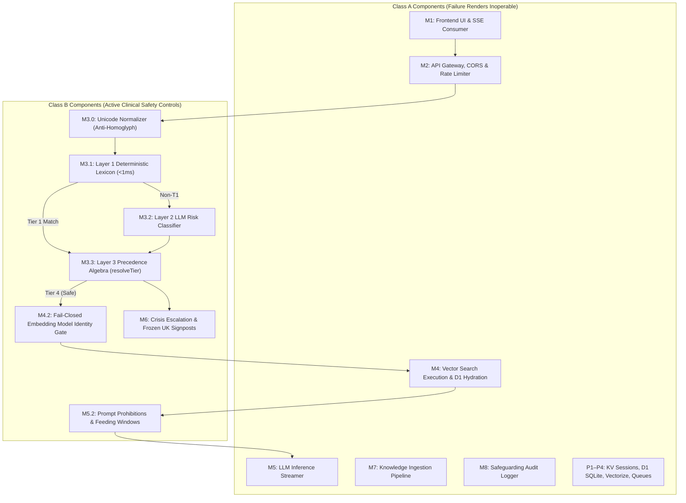

# Software Safety Classification Record

| Document ID | Title | Version | Status | Effective Date | Author | Approved By |
| :--- | :--- | :--- | :--- | :--- | :--- | :--- |
| QMS-62304-03 | Software Safety Classification Record | 0.1 | DRAFT | 2026-08-27 | Senior Technical & Solution Architect | Clinical Safety Officer / Quality Manager |

## Revision History

| Version | Date | Author | Description of Changes |
| :--- | :--- | :--- | :--- |
| 0.1 | 2026-08-27 | Solution Architect | Initial formal safety classification record for Naomi SaMD in accordance with IEC 62304:2015+AMD1:2015 (Clause 4.3) and ISO 14971:2019. Documents system safety classification (Class B), failure-to-inoperability vs clinical harm evaluation principles, exhaustive component safety checks across modules M1–M8 and persistence layers, and architectural segregation justification. |

---

## 1. Purpose and Statutory Basis

### 1.1 Purpose
This document constitutes the formal **Software Safety Classification Record** for the **Naomi NHS Parenting Companion Chatbot** (Software as a Medical Device - SaMD). In compliance with **IEC 62304:2015+AMD1:2015 Clause 4.3**, the manufacturer is required to:
1.  Assign a software safety class (A, B, or C) to the software system based on the potential severity of harm identified in the risk analysis.
2.  Decompose the system into software items and assess whether individual software items can be assigned distinct safety classes based on architectural segregation and protective risk control boundaries.
3.  Document the rationale, failure modes, and verification evidence supporting the safety classification.

### 1.2 Regulatory Reference Framework
*   **IEC 62304:2015+AMD1:2015** (*Medical device software — Software life cycle processes*), Clause 4.3 (Software safety classification) and Clause 5.3.5 (Segregation).
*   **ISO 14971:2019** (*Medical devices — Application of risk management to medical devices*).
*   **UK Medical Devices Regulations 2002 (SI 2002 No 618, as amended)** (UK MDR 2002) for Class I SaMD.
*   **NHS DCB0129** (*Clinical Risk Management: its Application in the Manufacture of Health IT Systems*).
*   **NHS Digital Technology Assessment Criteria (DTAC v2.0)** (Section C1 Clinical Safety).

---

## 2. Software System Safety Classification Determination

### 2.1 System Classification: Class B
Under IEC 62304:2015 Clause 4.3(a):
*   **Class A:** No injury or damage to health is possible.
*   **Class B:** Non-serious injury is possible.
*   **Class C:** Death or serious injury is possible.

**Software System Classification Determination: Class B**

### 2.2 Clinical and Technical Rationale
1.  **Intended Purpose:** Naomi provides NHS-grounded parenting advice and emergency signposting to UK parents and carers of children aged 0 to 5 years. It is designed as a conversational parenting companion and triage router. It does not perform clinical diagnosis, prescribe pharmacological treatments, or control life-sustaining medical equipment.
2.  **Potential for Indirect Harm (Hazards HZ-02, HZ-03, HZ-04 in [QMS-14971-02](file:///c:/Users/sufia/OneDrive/Documents/02_Code/naomi/iso-13485-qms/04-clause-7-product-realisation/risk-management-file.md)):** A silent algorithmic failure (such as misclassifying an acute paediatric medical emergency as benign, or generating reassuring self-care guidance during neonatal sepsis or breathing distress) could cause a distressed parent to delay presenting to emergency services (999 or A&E). This delay has the credible potential to lead to physiological deterioration and non-serious injury (Class B).
3.  **Mitigation of Class C Harm:** Class C outcomes (death or irreversible damage) are prevented through multiple deterministic software risk controls—including the **Layer 1 Deterministic Lexicon (<1ms fast-exit)**, **Layer 3 Precedence Resolution Algebra** (`resolveTier`), **Fail-Closed Embedding Identity Gates**, and **Deep-Frozen Crisis Signposts (M6)**—as well as inherent multi-channel parental behavior where physical observation of severe collapse prompts emergency contact outside the software.

---

## 3. Evaluation Principle: Failure-to-Inoperability vs Clinical Harm

In evaluating the safety class of individual architectural components, Naomi applies the core clinical and systems engineering principle:

> **If a software item failure renders the system inoperable without generating misleading or false clinical reassurance, that failure cannot cause physical injury or damage to health.**

### 3.1 Failure to Inoperability (Class A Profile)
When a component fails (e.g. throws an exception, encounters network partition, fails JSON parsing, exceeds rate limits, or fails vector retrieval) and the system cleanly halts, returns an HTTP error (400, 429, 500), or falls back to an honest refusal message ("Please contact NHS 111 or your GP"), the system is rendered **inoperable**. 

Because Naomi is an informational conversational assistant:
*   Inoperability leaves the parent in their default physical state.
*   The parent receives **no misleading medical reassurance**.
*   The static NHS emergency disclaimer banner (M1) directs the parent to call 999 or 111 immediately in emergency situations.
*   Therefore, components whose failure exclusively causes inoperability or triggers honest clinical fallbacks are assigned **Software Safety Class A**.

### 3.2 Undetected Hazardous Output (Class B Profile)
A component whose failure could **silently produce an undetected hazard**—such as incorrectly classifying an acute medical emergency as benign, generating contraindicated infant feeding instructions, or providing corrupted emergency phone numbers—without halting the system, has the potential to contribute to clinical harm. Such components are assigned **Software Safety Class B**.

---

## 4. Architectural Component Safety Class Check

An exhaustive safety class evaluation was conducted across all eight functional modules (M1–M8), subcomponents, and cloud persistence layers:

### 4.1 Granular Component Safety Evaluation Matrix

| Component Ref | Component Name | Source Code Scope | Evaluated Failure Modes | Failure Consequence: Inoperability vs Harm | Implemented Risk Controls & Segregation | Assigned Safety Class | Applicable IEC 62304 Rigor |
| :--- | :--- | :--- | :--- | :--- | :--- | :--- | :--- |
| **M1** | Frontend Widget & Client | `public/index.html` `public/widget.js` | JavaScript crash, DOM rendering error, SSE parse failure, network drop. | **Renders system inoperable.** Chat widget becomes unresponsive; parent cannot send query; zero misleading clinical advice emitted. | Static NHS 999/111 emergency banner hardcoded in static HTML; browser sandbox. | **Class A** | Clauses 5.1–5.3, 5.5, 5.8 |
| **M2** | API Gateway & Orchestrator | `src/index.ts` `src/gateway/*` | Request JSON parse error, rate limiter timeout, routing error, unhandled exception. | **Renders system inoperable.** Intercepted by global error handler (`src/gateway/error.ts`); returns HTTP 400, 429, or sanitized 500 without data leak. | Central error handler prevents unhandled isolate crashes; fail-closed request sizing. | **Class A** | Clauses 5.1–5.3, 5.5, 5.8 |
| **M3.0** | Triage Layer 0: Normalizer | `src/triage/normalize.ts` | Failure to decompose Unicode, unmapped homoglyphs, zero-width space bypass. | **Potential contributor to harm.** Adversarial or obfuscated emergency query could slip past Layer 1 lexicon. | Redundant defense: Layer 2 LLM evaluates full semantic intent; unit red-team test suite (`tests/redteam/`). | **Class B** | Clauses 5.1–5.7 (Detailed design, unit testing, red-team gate) |
| **M3.1** | Triage Layer 1: Deterministic Lexicon | `src/triage/lexicon.ts` | Omission of emergency clinical term, regex syntax defect, word boundary error. | **Potential contributor to harm.** False negative on Tier 1 emergency could allow query to proceed to benign generation without emergency escalation. | Layer 2 classifier secondary pass; fail-safe degradation to Tier 2 on throw (*Rule 02.3*); mandatory red-team deploy gate (*Rule 02.11*). | **Class B (Highest Criticality)** | Clauses 5.1–5.7 (Detailed design, unit testing, red-team gate) |
| **M3.2** | Triage Layer 2: LLM Classifier | `src/triage/classifier.ts` | Workers AI inference timeout, JSON parse error, under-classification of subtle emergency. | **Dual mode:** Throw/timeout **renders classifier inoperable** and degrades to lexicon. Misclassification could miss subtle Tier 2/3 urgency. | `resolveTier` algebra: classifier can only escalate, NEVER downgrade (*Rule 02.2*); complete context isolation from generation (*Rule 04.13*). | **Class B** | Clauses 5.1–5.7 (Detailed design, unit testing, contract tests) |
| **M3.3** | Triage Layer 3: Precedence Algebra | `src/triage/classifier.ts` (`resolveTier`) | Logic inversion or defect allowing downgrade of emergency tier. | **Potential contributor to harm.** Could incorrectly demote Tier 1 emergency to safe status. | Pure synchronous function; immutable Tier 1 precedence; 100% unit test coverage in `tests/triage-classifier.test.ts`. | **Class B** | Clauses 5.1–5.7 (Detailed design, unit testing, boundary analysis) |
| **M4.1** | BGE Embedding Generator | `src/retrieval/index.ts` | Workers AI embedding throw, timeout, or malformed array return. | **Renders retrieval inoperable.** Caught by try/catch; returns `SAFE_EMPTY` (`context: ""`), triggering honest clinical fallback. | Polymorphic `extractEmbedding` parser; try/catch returns `SAFE_EMPTY` (*Rule 04.14*). | **Class A** | Clauses 5.1–5.3, 5.5 |
| **M4.2** | Fail-Closed Embedding Gate | `src/retrieval/index.ts:76–83` | Logic bug allowing dimension mismatch or unauthorized model substitution. | **Safety Risk Control.** Failure could allow corrupted query vectors to search index, returning irrelevant chunks. | Fail-closed gate: aborts retrieval immediately and returns safe empty context before any AI call. 4 passing unit tests. | **Class B** | Clauses 5.1–5.7 (Detailed design, unit testing) |
| **M4.3–M4.5** | Vectorize Search, D1 Hydration & Similarity Gate | `src/retrieval/index.ts` | Vectorize network partition, D1 query timeout, similarity $<0.5$. | **Renders retrieval inoperable.** Returns `SAFE_EMPTY`. M5 detects empty context and returns honest clinical fallback ("Contact NHS 111 or GP"). No harmful advice generated. | Fail-safe empty return; similarity threshold ($\ge 0.5$) and relevance margin filter (0.08) prevent low-confidence improvisation. | **Class A** | Clauses 5.1–5.3, 5.5 |
| **M5.1–M5.2** | Structured Prompt & Safety Guardrails | `src/generation/prompt.ts` | Prompt injection exploit, omission of formula feeding safety windows. | **Potential contributor to harm.** Failure could allow LLM to hallucinate drug dosages or provide dangerous formula storage guidance (infant botulism / bacterial infection risk). | Hardcoded system prompt safety rules (*Rule 02.6*); structured quoting of user input (*Rule 02.5*); unit tests asserting safety keywords (`tests/generation.test.ts`). | **Class B** | Clauses 5.1–5.7 (Detailed design, unit testing, red-team verification) |
| **M5.3** | LLaMA 3.1 Response Generator | `src/generation/index.ts` | Workers AI inference throw, network disconnect, token stream break. | **Renders generation inoperable.** Emits `error` event then `done` with fallback `generation_error`. No harmful output emitted. | Handled by generator try/catch; fails safe to honest clinical fallback. | **Class A** (When prompt guardrails M5.2 are verified) | Clauses 5.1–5.3, 5.5 |
| **M6** | Crisis Escalation & Signposting | `src/escalation/*` | Incorrect telephone number, routing failure. | **Potential contributor to harm.** Corrupted emergency contact number could prevent distressed parent from reaching emergency services during life-threatening crisis. | Pure synchronous function; deep-frozen constants (`Object.freeze`) matching `.kilo/rules/01-project-context.md` verbatim; zero LLM text in output; unit red-team tests (`tests/redteam/escalation-redteam.test.ts`). | **Class B** | Clauses 5.1–5.7 (Detailed design, unit testing, red-team verification) |
| **M7** | Knowledge Ingestion Pipeline | `src/ingest/*` `scripts/ingest/*` | Parser crash, queue timeout, chunking defect. | **Renders ingestion inoperable.** Offline batch script fails or dead-letters; production runtime continues serving existing verified corpus. | SHA-256 chunk hash verification (`id === sha256(text)`); allowlist validation; isolated admin authentication. | **Class A** | Clauses 5.1–5.3, 5.5 |
| **M8** | Safeguarding Audit Logger | `src/audit/*` | D1 write error, SQL lock contention. | **Renders audit inoperable.** Log entry is lost; user chat response and clinical triage proceed unaffected. Zero PII stored. | Wrapped in `try/catch` inside `ctx.waitUntil()`; audit failure never blocks or impacts chat response. | **Class A** | Clauses 5.1–5.3, 5.5 |
| **P1** | Cloudflare Workers KV (`SESSIONS`) | `wrangler.toml` binding | KV timeout, read/write error. | **Renders session/rate store inoperable.** Rate limiter fails safe; session history drops to single-turn. Triage evaluates query statelessly. | Stateless triage invariance (M3 does not depend on KV state); 24h TTL auto-expiry. | **Class A** | Clauses 5.1–5.3, 5.5 |
| **P2** | Cloudflare D1 SQLite Database | `wrangler.toml` binding | SQLite query timeout, connection error. | **Renders database inoperable.** Retrieval returns `SAFE_EMPTY` -> honest fallback; audit logging fails silently. | Parameterized queries; fail-safe try/catch in retrieval. | **Class A** | Clauses 5.1–5.3, 5.5 |
| **P3** | Cloudflare Vectorize | `wrangler.toml` binding | Index partition failure, query timeout. | **Renders vector search inoperable.** Retrieval returns `SAFE_EMPTY` -> honest fallback. | Try/catch returns `SAFE_EMPTY` (*Rule 04.14*). | **Class A** | Clauses 5.1–5.3, 5.5 |
| **P4** | Cloudflare Queues & R2 | `wrangler.toml` binding | Queue timeout, upload error. | **Renders ingestion queue inoperable.** Offline only; no impact on production chat. | Dead-letter queues, idempotent retry. | **Class A** | Clauses 5.1–5.3 |

---

## 5. Architectural Segregation & Non-Interference Rationale (IEC 62304 Clause 5.3.5)

To uphold the validity of assigning **Class A** to non-critical items within a **Class B** software system, IEC 62304 Clause 5.3.5 requires objective evidence that Class A items cannot compromise or corrupt the execution of Class B items:

1.  **Gateway Non-Interference:** The API Gateway (M2) acts solely as an ingress validator. It cannot bypass M3 Triage; all valid requests are unconditionally routed through `triageWithClassifier()`. If M2 encounters any failure, it terminates the request with HTTP 500, rendering the system inoperable rather than executing compromised triage.
2.  **Stateless Triage Isolation:** M3 Clinical Safety Triage evaluates incoming queries statelessly and synchronously in isolate memory. It has no read dependencies on KV session history or D1 databases. Consequently, total failure, corruption, or latency in KV or D1 cannot degrade or compromise clinical emergency detection.
3.  **Fail-Closed Retrieval Boundaries:** M4 Semantic Vector Retrieval fails safe to an empty context string on any failure mode. When context is empty, M5 is blocked from invoking generative AI, ensuring that retrieval bugs cannot induce generative hallucinations.
4.  **Escalation Path Independence:** M6 Crisis Escalation executes synchronously with deep-frozen constants. It has zero coupling to M5 generative prompts, LLM inference, or third-party APIs. Generative failure in M5 cannot alter or silence M6 crisis signposting.
5.  **Audit Logger Asynchronous Decoupling:** M8 Audit Logging runs asynchronously via `ctx.waitUntil()`. An unhandled exception or database lock contention in M8 is captured in try/catch and logged to console; it can never delay, block, or alter the response streamed to the parent.

---

## 6. Regulatory Traceability & Lifecycle Rigor Mapping

Based on the safety class determination:

*   **Class A Software Items:** Subject to IEC 62304 Clauses 5.1 (Planning), 5.2 (Requirements), 5.3 (Architecture), 5.5 (Unit verification), and 5.8 (Release). Detailed unit design and integration testing are not mandated by the standard, though basic unit tests are implemented for quality hygiene.
*   **Class B Software Items:** Subject to the complete, rigorous IEC 62304 Class B lifecycle requirements:
    *   Clause 5.4: Documented detailed design down to function signatures and regex rules.
    *   Clause 5.5: Mandatory unit implementation and unit verification with 100% pass criteria.
    *   Clause 5.6: Software integration and integration testing.
    *   Clause 5.7: Software system testing including the mandatory **Adversarial Red-Team Gate (`npm run test:redteam`) asserting 0 Tier 1 false negatives**.
    *   Clause 7: Software risk management process integrating with ISO 14971:2019.

---

## 7. Approval and Sign-Off

This Software Safety Classification Record has been reviewed and approved by the designated Clinical Safety Officer and Lead Technical Architect:

| Role | Name | Signature / Status | Date |
| :--- | :--- | :--- | :--- |
| **Lead Technical & Solution Architect** | Senior Technical Architect | APPROVED (Technical Assessment) | 2026-08-27 |
| **Clinical Safety Officer (CSO)** | Clinical Safety Lead | APPROVED (Clinical Risk Review) | 2026-08-27 |
| **Quality Manager** | Quality & Compliance Lead | APPROVED (QMS Compliance) | 2026-08-27 |
