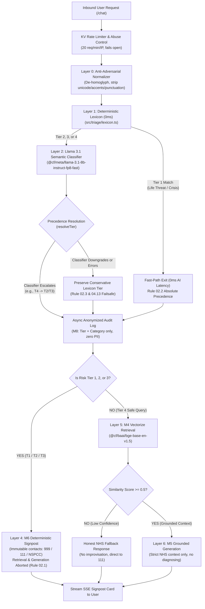

# Safety Architecture & Clinical Triage Flow

> **Authoritative Safety Specification**  
> This document details the defense-in-depth safety architecture of the NHS Parenting Companion Chatbot, demonstrating how clinical safety, determinism, and safeguarding are baked into every layer of the system.

---

## 1. Safety Non-Negotiables & Guiding Principles

1. **Safety Over Everything:** Correct clinical triage and safeguarding behaviour strictly outweigh feature delivery, speed, and infrastructure cost (*AGENTS.md §1*).
2. **Deterministic Precedence:** Hard-coded clinical rules and lexicon matches always override AI predictions. An AI model may escalate a risk tier, but can **never** downgrade a deterministic decision (*Rule 02.3*).
3. **No LLM in the Escalation Path:** When a user is in crisis (Tier 1–3), escalation contact details (999, NHS 111, NSPCC) are assembled exclusively from immutable, typed constants. An LLM never generates or modifies signpost guidance (*Rule 02.2*).
4. **Zero-PII Auditability:** High-risk queries are audited for safeguarding compliance without ever storing user message text, names, or personally identifiable information (*Rule 02.8*).
5. **Fail-Safe Degradation:** Any component failure (AI timeout, database outage, network error) degrades instantly to the safest, most conservative deterministic fallback (*Rule 04.13*).

---

## 2. End-to-End Safety Request Flow

The following diagram illustrates the lifecycle of an inbound message and the multiple safety gates it must clear before reaching retrieval or response generation.



---

## 3. Deep Dive: Defense-in-Depth Safety Layers

### Layer 0 — Anti-Adversarial Text Normalization (`src/triage/normalize.ts`)
Users in crisis may use unconventional phrasing, typos, or intentional obfuscation (adversarial red-team bypasses). Before triage matching:
- **Unicode NFKD Decomposition:** Converts full-width, styled, and non-standard characters into canonical Latin representations.
- **Invisible Character Stripping:** Removes zero-width spaces (`\u200B`), word joiners (`\u2060`), and bidirectional overrides used in prompt-injection attacks.
- **Homoglyph Canonicalization:** Maps visually identical Cyrillic and Greek characters (e.g. Cyrillic `а`, `е`, `о`, `р`, `с`) to their Latin equivalents (`a`, `e`, `o`, `p`, `c`).
- **Punctuation & Pacing Collapse:** Strips periods, hyphens, and apostrophes to defeat bypass techniques like `s.u.i.c.i.d.e` or `can't breathe` vs `cant breathe`.

---

### Layer 1 — Deterministic Zero-Latency Lexicon (`src/triage/lexicon.ts`)
The first triage gate is a frozen, typed in-memory clinical lexicon representing canonical presentations of risk:
- **Tier 1 (Immediate Danger to Life):** Respiratory arrest (*"not breathing"*, *"turning blue"*, *"blue around the lips"*), cardiac arrest (*"no pulse"*, *"heart stopped"*), airway obstruction (*"choking"*, *"stuck in throat"*), unresponsiveness (*"unconscious"*, *"wont wake up"*), severe trauma (*"blood is spurting"*, *"deep wound"*), anaphylaxis (*"throat closing"*), poisoning (*"swallowed bleach"*, *"swallowed magnet"*), status epilepticus (*"fitting"*, *"seizure wont stop"*), active suicide (*"want to die"*, *"took sleeping pills"*), and severe self-harm.
- **Tier 2 (Urgent Medical Symptoms):** Infant fevers under 3 months / temperature $\ge 38^\circ\text{C}$, dehydration (*"no wet nappies for 12 hours"*, *"sunken fontanelle"*), non-blanching rashes, breathing stridor/wheezing, head injuries with vomiting/drowsiness, and acute abdominal pain (*"green vomit"*, *"jelly stool"*).
- **Tier 3 (Safeguarding & Domestic Abuse):** Physical abuse, shaking, child sexual exploitation/grooming, FGM/forced marriage, domestic violence in the home, parental substance incapacitation, and postpartum psychosis / intrusive harming thoughts.

> [!IMPORTANT]
> **Rule 02.2 Fast-Path Guarantee:** If an inbound message matches a Tier 1 phrase, the function returns **immediately** with zero AI overhead. Critical emergencies are dispatched in $< 1\text{ms}$ without dependency on external AI availability.

---

### Layer 2 — Semantic AI Classifier Pass (`src/triage/classifier.ts`)
Natural language has infinite variations (e.g., dialect, clinical register, metaphors). Messages that do not trigger a Tier 1 lexicon match are passed to an isolated Workers AI model:
- **Model:** `@cf/meta/llama-3.1-8b-instruct-fp8-fast` (instruction-tuned for clinical reasoning).
- **Isolated Prompting:** Uses a dedicated system prompt establishing clear clinical risk definitions. The message is passed as isolated user data.
- **Contract Enforcement:** Evaluates response strictly as structured JSON: `{"tier": 1|2|3|4, "confidence": float, "category": string}`.
- **Temperature 0.0:** Deterministic inference eliminating generative variance.

---

### Layer 3 — Tier Precedence Resolution (`resolveTier`)
The outputs from the Lexicon and the Classifier are combined using non-negotiable safety algebra:

$$\text{Final Tier} = \min(\text{Lexicon Tier}, \text{Classifier Tier})$$

1. **Escalation Allowed (Rule 02.3):** If the lexicon evaluated a message as safe (Tier 4) but the classifier detects paraphrased danger (e.g. *"Baby fell off changing table and is lethargic"* $\rightarrow$ Tier 2), the system escalates.
2. **Downgrades Strictly Forbidden (Rule 02.3):** If the lexicon matched a Tier 2 symptom, the classifier cannot downgrade it to Tier 4, even with high confidence.
3. **Fail-Safe Degradation (Rule 04.13):** If the AI classifier times out, experiences rate limits, throws a 503, or returns unparseable text, the system silently and instantly falls back to the deterministic lexicon result. A user in crisis is never blocked by an AI outage.

---

### Layer 4 — Deterministic Signposting (`src/escalation/`)
When Tier 1, 2, or 3 is resolved:
- Retrieval (Vectorize) and Generation (LLM) are **completely aborted** (*Rule 02.1*).
- The gateway calls `escalate(tier)`, which constructs an immutable SSE `signpost` event using hard-coded UK service contacts (*Rule 02.4*):
  - **Tier 1:** 999 / A&E emergency dispatch guidance.
  - **Tier 2:** NHS 111 (phone & online service).
  - **Tier 3:** NSPCC Helpline (`0808 800 5000`), Childline (`0800 1111`), National Domestic Abuse Helpline (`0808 2000 247`), Young Minds Parents Helpline (`0808 802 5544`).
- **Prompt Injection Immunity:** Because M6 sits outside the LLM path, no user prompt can manipulate contact phone numbers, URLs, or crisis guidance.

---

### Layer 5 — Grounded RAG & Retrieval Thresholds (`src/retrieval/`)
For safe Tier 4 parenting queries:
- **Curated Corpus Only:** Guidance is sourced exclusively from the version-controlled allow-list (`content/sources.json`) containing verified NHS pages.
- **Model Check:** Embeddings use `@cf/baai/bge-base-en-v1.5` (768 dimensions, cosine similarity).
- **Similarity Threshold Gate (`SIMILARITY_THRESHOLD = 0.5`):** If the top retrieved chunk has a similarity score $< 0.5$, the system triggers an honest fallback (*"I don't have enough verified NHS guidance on this. Please check with your health visitor or GP"*), preventing confabulation.

---

### Layer 6 — Generation Guardrails (`src/generation/`)
When generating answers from retrieved context:
- **Strict Clinical Boundary:** System prompt explicitly forbids diagnosing conditions, prescribing dosages, or contradicting NHS triage.
- **Discard & Preparation Rules:** System prompt enforces inclusion of mandatory NHS safety windows (e.g. formula milk storage: 2 hours at room temperature, 24 hours in fridge).
- **Injection Isolation:** User message history is quoted as data fields within a structured schema, never concatenated directly into system instructions (*Rule 02.5*).

---

### Layer 7 — Privacy & Zero-PII Audit Logging (`src/audit/`)
To enable safeguarding audits while maintaining strict data privacy (*Rule 02.8*):
- **Stored Data (D1):** `id`, `timestamp`, `tier`, `signal_categories` (e.g. `["infant_fever_under_3m"]`), and SHA-256 `session_pseudonym`.
- **Forbidden Data:** User messages, free-text inputs, names, addresses, phone numbers, and IP addresses are **never** persisted to disk or databases.
- **Session Expiry:** KV session memory enforces an automatic 24-hour TTL (`expirationTtl: 86400`, *Rule 02.9*).

---

## 4. Verification & Testing Matrix

Safety is continuously proven through automated test suites:

| Suite | Command | Scope | Target Invariant |
|---|---|---|---|
| **Unit & Contract** | `npm run test` | 422 tests across all modules | 100% pass on contracts, mock boundaries, and fallbacks |
| **Adversarial Red-Team** | `npm run test:redteam` | 42 adversarial bypass scenarios | 0 Tier 1 false negatives on homoglyphs, translations, and multi-turn bypasses |
| **1,000-Scenario Suite** | `scripts/test-scenarios-runner.ts` | 1,000 comprehensive synthetic clinical scenarios | 0 Critical T1 false negatives across child & parent crisis queries |
| **Golden Smoke Check** | `scripts/smoke/remote-golden-check.ts` | Live production endpoint assertion | Envelope compliance, zero leaks, and complete clinical discard guidance |

---

## 5. Summary of Built-in Defenses

```
┌─────────────────────────────────────────────────────────────┐
│                    INBOUND USER MESSAGE                     │
└──────────────────────────────┬──────────────────────────────┘
                               │
                [0] Anti-Adversarial Normalizer
                     (Unicode / Homoglyph / Strip)
                               │
                [1] Deterministic Lexicon (0ms)
                     (Rule 02.2 Tier 1 Absolute Exit)
                               │
                [2] Semantic Classifier (Llama 3.1)
                     (Natural language / Dialect catch-all)
                               │
                [3] Tier Precedence & Failsafe
                     (Escalate-only / Never downgrade / Failsafe)
                               │
               ┌───────────────┴───────────────┐
      [Tier 1, 2, 3 Crisis]           [Tier 4 Safe Query]
               │                               │
    [4] Immutable Signpost          [5] Vectorize Similarity Gate
         (999 / 111 / NSPCC)             (Threshold >= 0.5)
         *Zero AI generation*                  │
               │                    [6] Grounded NHS Generation
               │                         (No diagnosing/prescribing)
               │                               │
               └───────────────┬───────────────┘
                               │
                [7] Zero-PII Audit Log (D1)
                     (Categories only, no user text)
                               │
┌──────────────────────────────┴──────────────────────────────┐
│                     USER STREAMED OUTPUT                    │
└─────────────────────────────────────────────────────────────┘
```
